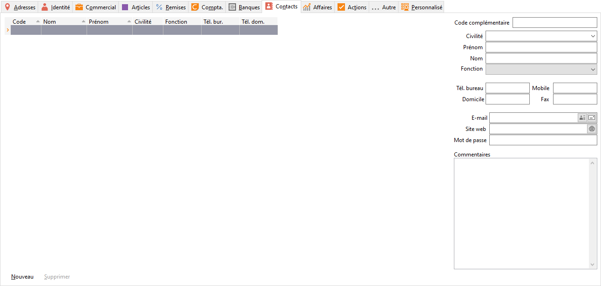

# Contacts

Cet onglet permet de rattacher des contacts au tiers. De ce fait, toutes 
 les actions entreprises à l’attention d’un de ces contacts seront intégrées 
 dans le suivi commercial du tiers. Les contacts créés ici seront intégrés 
 automatiquement au fichier des contacts (menu TIERS/Contacts).

 

 

La grille à droite de la fiche Contact affiche la liste des tous les 
 contacts associé à ce tiers.

