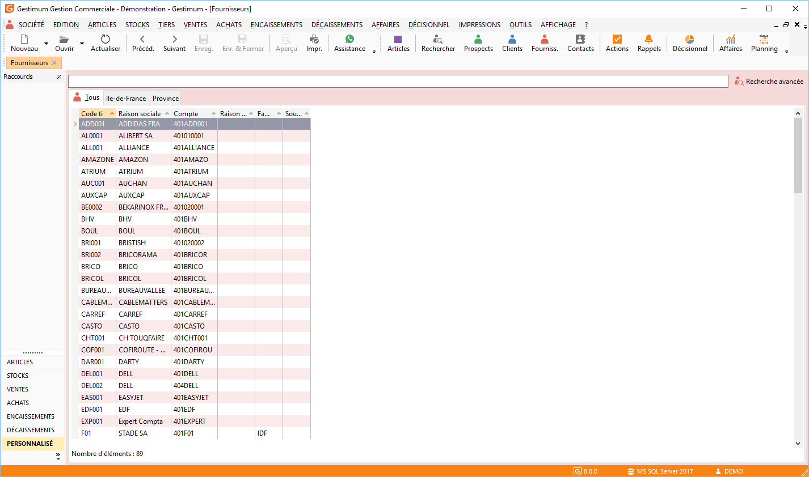

# Liste des fournisseurs

La gestion des fournisseurs (création, modification, suppression, impression) 
 s’effectue à partir de la barre d'outils, du menu contextuel ou des raccourcis 
 claviers.

 

 

Toutes les listes ont un fonctionnement commun.

## Recherche de fournisseurs

Deux possibilités de recherche fournisseurs sont disponibles: la recherche 
 standard commune à toutes les grilles et la [recherche 
 plus poussée](../9/Recherche.md) accessible par le menu Edition ou par clic dans la zone 
 Rechercher puis la combinaison de touches Ctrl 
 + F.

## Opérations disponibles à partir de la liste des fournisseurs

Pour chaque fournisseur de la liste, le menu contextuel (clic droit) 
 permet d’accéder :

* A la création d’une 
 nouvelle fiche,
* A l’ouverture d'une 
 fiche,
* A l’affichage ou 
 non des fournisseurs en sommeil,
* A la suppression 
 d’une fiche,
* A la duplication 
 de la fiche ,
* A la recherche 
 d'une fiche,
* A la création d’un 
 nouveau document à son attention,
* A la liste des 
 documents réalisés pour ce fournisseur,
* A une Nouvelle 
 échéance pour ce tiers,
* A l’historique 
 du fournisseur,
* A l’extrait de 
 compte,
* A l’Impression 
 ou aperçu des étiquettes, échéances, relevés de factures, règlements, 
 paiements et de statistiques,
* Au rafraîchissement 
 de la fiche,
* Aux fonctions générales 
 d'une grille.

