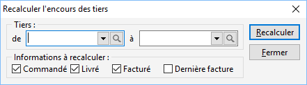

# Recalcul des encours des tiers

 

Pour une sélection de tiers, vous avez la possibilité de recalculer 
 les encours et de ré-affecter la dernière facture.

 

Ces informations sont présentes dans l'onglet Compta des fiches tiers.

## Sélection du tiers

Pour sélectionner un tiers ou une fourchette de tiers, vous avez la 
 possibilité d’utiliser la liste déroulante ou la [recherche 
 tiers](../../8/MiseJourTiersRecherche.md).

## Sélection de l’option

Suivant l’option que vous choisissez le recalcul s’effectuera sur :

* l'encours commandé
* l'encours livré
* l'encours facturé

 

L’option "Recherche de la dernière facture" permet de mettre 
 à jour la visualisation de la dernière facture réalisée pour le tiers.

## Traitement du recalcul

Une fois ces sélections effectuées, vous devez cliquer sur le bouton 
 "Recalculer".

 

Un message vous demande de confirmer le recalcul des options que vous 
 venez de choisir.

 

Une barre de progression vous permet de visualiser l’évolution du traitement.

 

La fin du traitement est indiquée par un message.

