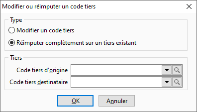

# Modification ou réimputation d'un code tiers

 

Cet outils permet de remplacer un code tiers par : 

* un autre (Renommer 
 un tiers)
* un autre existant 
 (Réimputer complètement sur un tiers existant)

 

Le nouveau code sera automatiquement affecté à la place du précédent 
 dans tous les documents, échéances …

## Modalités pour pouvoir effectuer la réimputation

### Droit

Vous devez avoir sélectionner par le menu SOCIETE | Utilisateurs le droit 
 d’exécuter sur l’option "Outils"
+ "Réimputations"
et le droit "Tiers"
pour pouvoir exécuter ce traitement.

## Paramétrage et lancement de la réimputation

Vous devez dans un premier temps sélectionner l’option renommer un tiers 
 ou réimputer complètement sur un tiers existant.

### Renommer un tiers

Cette option permet de changer le code d’un tiers par un autre code 
 inexistant dans la base.

 

Pour cela, sélectionnez ou saisissez le code tiers que vous souhaitez 
 renommé (Tiers d’origine). Puis, saisissez le nouveau code du tiers que 
 vous souhaitez (Tiers destinataire).

 

Ensuite, vous devez lancer le traitement par le bouton Renommer. Un 
 message vous demandera de confirmer le changement de code et dans l’affirmatif 
 le code tiers sera renommé.

### Réimputer complètement sur un tiers existant

Cette option permet de changer le code d’un tiers par un autre code 
 existant dans la base.

 

Pour cela, sélectionnez ou saisissez le code tiers que vous souhaitez 
 réimputer (Tiers d’origine). Puis, sélectionnez ou saisissez le nouveau 
 code du tiers que vous souhaitez (Tiers destinataire).

 

Ensuite, vous devez lancer le traitement par le bouton Réimputer. Un 
 message vous demandera de confirmer le changement de code et dans l’affirmatif 
 le code tiers sera reimputé.

