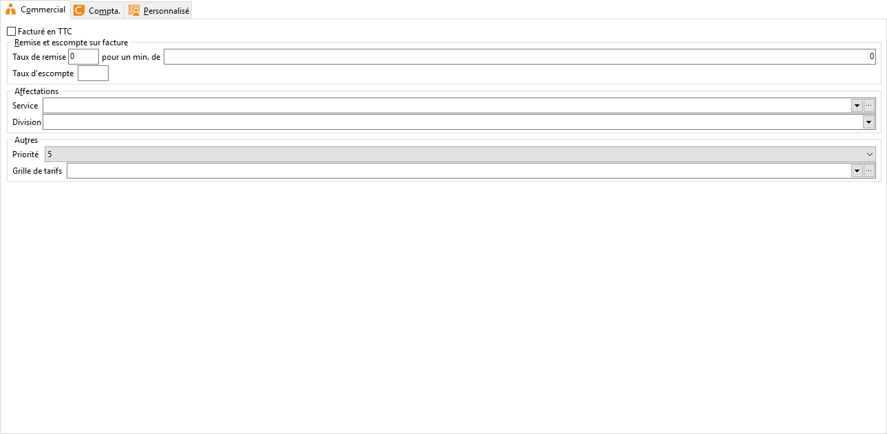

# Commercial

Les informations de cet onglet seront reprises dans l’[onglet 
 admin](../../3/Client/ClientOngletCommercial.md) de la fiche tiers associé, lors de l’acception des informations 
 de la fiche famille.

 

 

Ces informations sont :

* Définition d’une 
 Remise et/ou Escompte 
 sur facture,
* L’affectation d’un 
 Service ou d’une Division,
* Définition de la 
 priorité,
* Définition d’une 
 grille de tarifs.

 

Reportez vous à la [fiche 
 tiers](../../3/Client/ClientOngletCommercial.md) pour avoir plus de détail sur ces fonctions.

