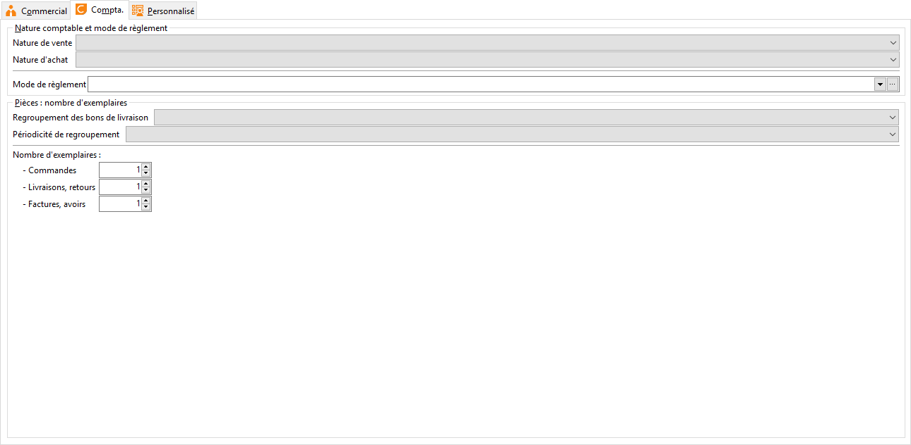

# Compta

Les informations de cet onglet seront reprises dans l’[onglet 
 compta](../../3/Client/ClientOngletCompta.md) de la fiche tiers associé, lors de l’acception des informations 
 de la fiche famille.

 

 

Ces informations sont :

* Nature 
 Comptable,
* Mode 
 de règlement,
* Nombre 
 d’exemplaire,
* Regroupement. 
 BL,
* Périodicité.

 

Reportez vous à la [fiche 
 tiers](../../3/Client/ClientOngletCompta.md) pour avoir plus de détail sur ces fonctions.

