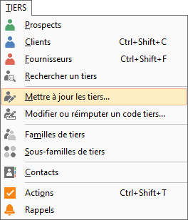

# Mise à jour des tiers

Cet assistant est appelé depuis le menu TIERS 
 | Mettre à jour les tiers.

 

 

Il permet de mettre à jour automatiquement les champs "Grille de 
 tarifs", "Port", "Frais" et "Frais supplémentaires" 
 sur les fiches tiers sélectionnées.

## Modalités pour pouvoir effectuer la mise à jour

### Droit

Vous devez avoir sélectionner par le menu SOCIETE + Utilisateurs le 
 droit de modifier la fiche client ou fournisseur ou prospect pour pouvoir 
 exécuter ce traitement.

## Paramétrage et lancement de la mise à jour

La mise à jour des fiches tiers s’effectue par un assistant qui détaille 
 une à une chaque étape. Utilisez les boutons Suivant et Précédent pour 
 passer d’étape en étape.

 

Les étapes sont :

* [Recherche](MiseJourTiersRecherche.md) 
 des tiers à mettre à jour,
* [Vérifications](MiseJourTiersSelectionTiers.md) 
 et modifications de la liste des tiers qui seront mis à jour,
* [Choix des 
 champs](MiseJourTiersSelectionChamps.md) à mettre à jour.

 

Une fois ces étapes terminées, vous pouvez cliquer sur le bouton "Terminer" 
 pour lancer le traitement et les fiches tiers seront mises à jour

