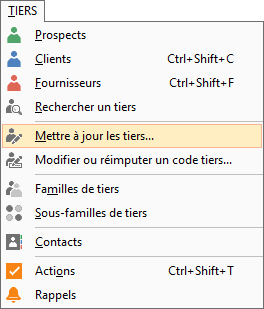
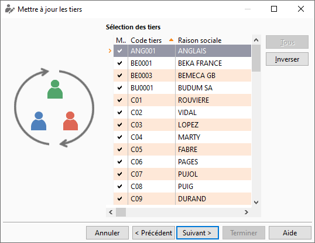
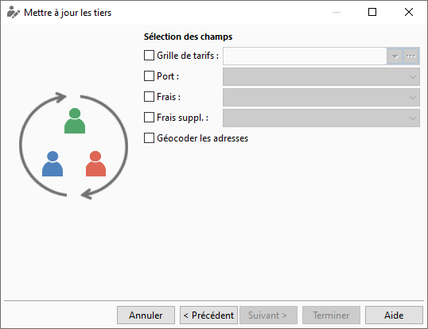

Mise à jour des tiers de A à Z

Il est possible, sur GESTIMUM ERP, de mettre à jour automatiquement certaines informations de la fiche tiers.

## Procédure

Lancez la mise à jour des tiers via le menu TIERS | Mettre à jour les tiers.

 

  

  

Sélectionnez le type de tiers (clients, fournisseurs ou prospects) puis les bornes souhaitées (famille, sous famille etc…).

 

Vous avez la possibilité de décocher certaines sélections afin de gérer les exceptions.

 

Vous pouvez maintenant sélectionner le type de mise à jour souhaitée. Ici par exemple nous allons affecter une grille de tarif ainsi que des frais. (Puis faites "Terminer" en bas à droite

 

## Résultat

Allez dans une fiche tiers que vous avez mise à jour via le menu "TIERS | Clients".

 

  

  

 Puis dans la fiche article allez dans l’onglet "Admin" et vous constaterez que votre tiers a été mis à jour.
 

 

