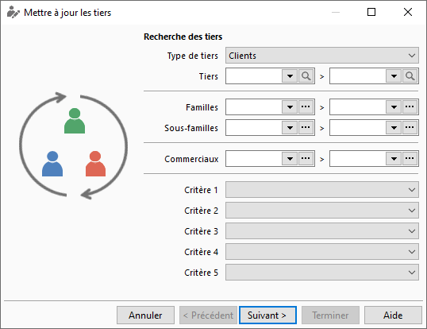

# Recherche des tiers

La recherche des tiers à mettre à jour consiste à déterminer les informations 
 suivantes présentes sur les fiches tiers à mettre à jour :

* Le type 
 de tiers (Clients, Prospects ou Fournisseurs)
* Un intervalle 
 de tiers
* Un intervalle 
 de famille de tiers
* Un intervalle 
 de sous famille de tiers
* Un intervalle 
 de commercial
* Un critère 
 précis (critère 1 à 5)

 

 

Une fois cette recherche déterminer, vous devez cliquer sur le bouton 
 Suivant afin de voir la pré-sélection de tiers effectuée.

