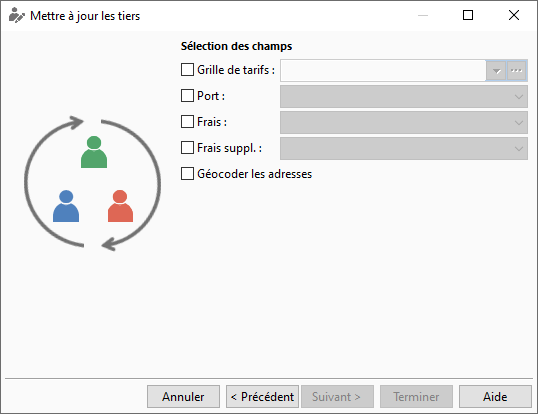

# Sélection des champs

Suite à la sélection des tiers à mettre à jour, vous devez déterminer 
 les champs à mettre à jour :

* Grille de tarifs
* Port
* Frais
* Frais supplémentaire

 

 

Suite à la sélection du champ, vous devez choisir dans la liste déroulante 
 la donnée à mettre à jour dans ce champ.

 

Si vous sélectionnez le champ mais aucune donnée, la donnée de ce champ 
 sera mise à "vide" dans le fichier lors du traitement de la 
 mise à jour.

 

Si vous sélectionnez aucun champ, vous ne pourrez pas lancer la mise 
 à jour par le bouton Terminer.

 

Lorsque vous avez terminé le choix des champs à mettre à jour, vous 
 devez cliquer sur le bouton Terminer afin que ces champs soient mis à 
 jour dans les fiches [Clients](../3/Client/ClientOngletCommercial.md), 
 [Fournisseurs](../4/Fournisseur/FournisseurOngletCommercial.md), 
 [Prospects](../2/Prospect/ProspectOngletCommercial.md) (onglet 
 admin) suivants les critères et sélections effectués précédemment.

 

Lors du traitement de la mise à jour des fiches tiers, vous pouvez avoir 
 le message d’avertissement suivant : "Certain tiers sont verrouillés 
 : 2 Ils ne peuvent être modifiés pour le moment.".

 

Cela signifie que des fiches tiers sont en cours de modifications et 
 ne peuvent pas être mises à jour. Dans ce cas, le traitement ne mettra 
 pas à jour les fiches de ces tiers

