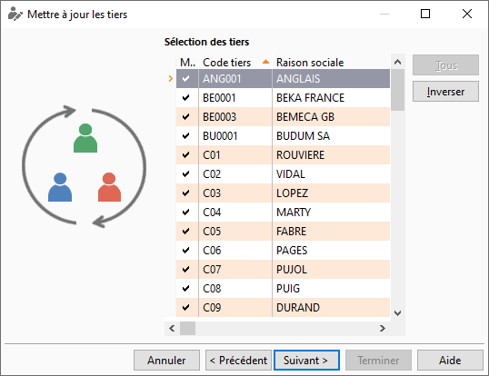

# Sélection des tiers

Suite à la recherche des tiers à mettre à jour, vous visualisez la liste 
 des tiers sélectionnés. Cette liste peut être acceptée en totalité ou 
 être modifiée à l’aide des boutons Tous 
 (sélection ou désélection de toutes les lignes), Inverser 
 (mise en sélection ou désélection de la ligne ou les lignes sélectionnées).

 

 

Le menu contextuel de la liste permet également ces sélections, désélections, 
 tous, inverser mais aussi d’accéder aux fonctionnalités générales d'une 
 grille.

 

Une fois cette sélection définie, vous devez cliquer sur le bouton Suivant 
 afin d’accéder à la fenêtre du choix des champs à mettre à jour

