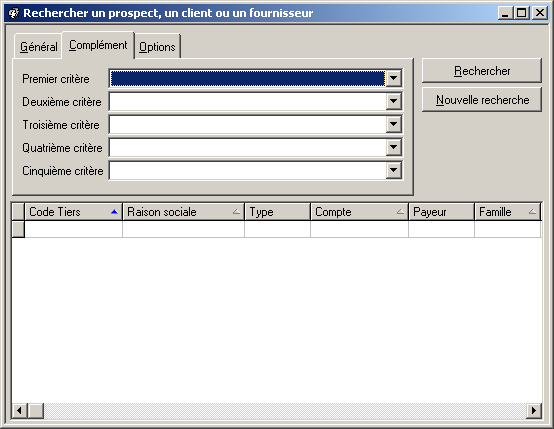

# Complément

Cet onglet permet de rechercher les tiers suivant  l’un des cinq 
 critères tiers définis dans les tables de références.

 

 

 

### Procédure de recherche:

Tous les critères de recherches de cette fiche sont de type combo-box. 
 Le premier d'entre eux est sélectionné d'office à l'ouverture de cette 
 fiche. Si vous désirez utiliser un autre critère sélectionnez  le 
 champ vide à coté du critère correspondant.

1. * Le bouton  
	  vous indique que vous êtes en présence de critères qui ont 
	 été subdivisé en plusieurs sous-critères. Si vous désirez réduire 
	 le champ de votre recherche en utilisant un des sous-critères 
	 pré-définis,  vous devez saisir le nom du sous-critère à 
	 utiliser ou le sélectionner dans la liste déroulante. Si le champ 
	 est laissé vide, la recherche se fait sur l'ensemble des éléments 
	 saisis pour ce critère.
	* En cas de besoin vous pouvez combiner les sous-critères 
	 en remplissant plusieurs champs de recherche de cette fiche même 
	 ainsi que sur les fiches Général et Options..
	* Lancez la recherche
	* Le résultat de la recherche s'affichera en bas 
	 de la fiche.
	* Une fois la recherche terminée. Vous pouvez lancer 
	 une autre recherche.

