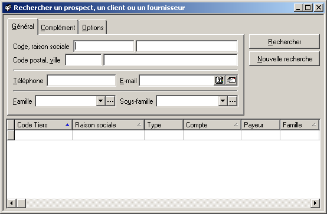
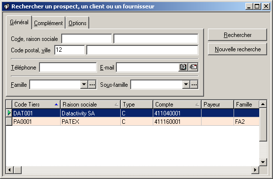

# Général

Cet onglet permet de rechercher les tiers suivant le code tiers, la raison sociale, le code postal, la ville, le numéro de téléphone, l’e-mail, la famille et la sous-famille de tiers.

 

 

 

 

Procédure de recherche :

* Pour utiliser les critères de type champ de texte (Code, raison sociale, Code postal, ville Téléphone ou e-mail)
* + Sélectionnez le champ vide à coté du critère de recherche que vous désirez utiliser pour effectuer la recherche.
	+ Si vous désirez réduire le champ de votre recherche tapez une lettre ou un chiffre contenu dans les éléments à rechercher pour ce champ. Si le champ est laissé vide, la recherche se fait sur l'ensemble des éléments saisis pour ce critère.
	+ En cas de besoin vous pouvez combiner les sous-critères en remplissant plusieurs champs de recherche.
	+ Lancez la recherche
	+ Le résultat de la recherche s'affiche en bas de la fiche (voir exemple ci-dessous).
	+ Une fois la recherche terminée. Vous pouvez lancer une autre recherche.

 

L'exemple ci-dessous montre l'ensemble des tiers dont le code postal contient 12 :

 

 

 

Pour utiliser les critères de type combo-box (Famille, Sous-famille)

* + Sélectionnez  tout d'abord le champ vide à coté du critère de recherche que vous désirez utiliser pour effectuer la recherche.
	+ Le bouton   vous indique que vous êtes en présence d'un critère qui a été subdivisé en plusieurs sous-critères. Si vous désirez réduire le champ de votre recherche en utilisant un des sous-critères pré-définis,  vous devez saisir le nom du sous-critère à utiliser ou le sélectionner dans la liste déroulante ou dans la liste affichée par l'intermédiaire du bouton . Si le champ est laissé vide, la recherche se fait sur l'ensemble des éléments saisis pour ce critère.
	+ En cas de besoin vous pouvez combiner les sous-critères en remplissant plusieurs champs de recherche.
	+ Lancez la recherche
	+ Le résultat de la recherche s'affiche en bas de la fiche comme dans l' exemple ci-dessus.
	+ Une fois la recherche terminée. Vous pouvez lancer une autre recherche.

