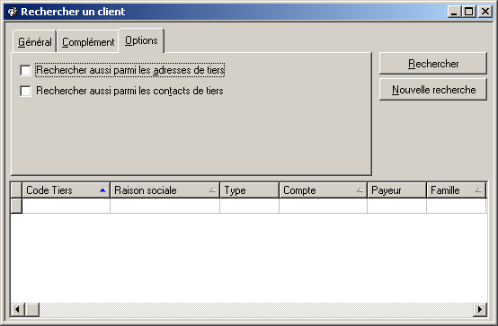

# Options

 

 

Ces options qu'il suffit de [cocher](#)(en cliquant 
 dessus ou en tapant Alt+"le caractère souligné") 
 pour les intégrer dans la recherche et de l'étendre à :

* la recherche de l'adresse de  tiers qui ne figurent pas 
 dans la liste des tiers recherchés par la fiche de recherche utilisée.  

 Dans l'exemple ci-dessus la recherche se fait en principe uniquement 
 sur les clients. Mais la sélection de l'option "Rechercher parmi 
 les adresses de tiers" permettrait d'intégrer les adresses de 
 fournisseurs et de prospects dans cette recherche.
* la sélection de l'option "Rechercher parmi les contacts 
 de tiers" permet d'élargir la recherche aux contacts des différents 
 tiers.

//<![CDATA[
 if( typeof( TextPopupInit ) != 'function' ) TextPopupInit = new Function();
 TextPopupInit('a1', 'POPUP306536784');
//]]>
