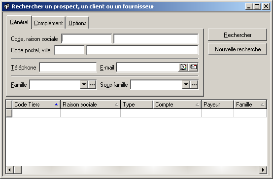

# Recherche de tiers

Permet de [rechercher](#Accès) des tiers sur la base de différents critères.

 

La fiche qui permet la recherche avec des critères d'ordre [Général](OngletGeneral/TiersRechercheOngletGeneral.md) est affichée automatiquement lors de l'[accès](#Accès) à la recherche. Les autres onglet peuvent être atteint en cliquant dessus ou en tapant Alt+ C pour accéder à la fiche [Complément](OngletComplement/TiersRechercheOngletComplement.md), respectivement Alt+O pour accéder à la fiche [Options](OngletOptions/TiersRechercheOngletOptions.md).

 

Cliquez sur l'un des onglets ci-dessous pour accéder à des informations plus détaillées.

 

  

## Accès au menu Rechercher un Tiers

Attention : Cette méthode d'accès n'est pas valable lorsqu'une fiche ou une liste d'éléments ne se rapportant pas à des tiers est ouverte.

 

Il faut donc fermer ce type de liste avant de pouvoir lancer une recherche se rapportant à des tiers.

 

| Barre de menu | Raccourci clavier |
|  | Ctrl+F |

