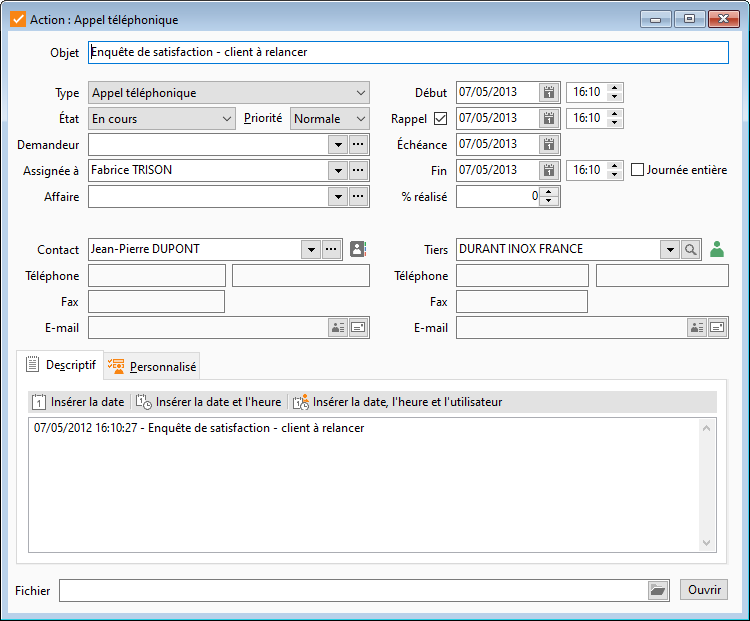

# Action

Une action est décrite par :

* Un type à définir dans 
 les tables (envoi de document, envoi de devis, prise de contact, questionnaire, 
 ..),
* Une date et une heure 
 de réalisation,
* Un état à définir dans 
 les tables de référence (En cours, Terminé). Les états présents historiquement 
 dans le code sont repris comme état par défaut dans les tables de 
 références. On retrouve ces états dans "État correspondant" 
 qui permet de garder un lien avec l'historique.

Dans les versions précédentes l'état proposé 
 par défaut à la création d'une action était l'état "En cours".

C'est maintenant le premier état (par ordre 
 alphabétique du code) dont l'état correspondant est "En cours".

* Une priorité (Faible, Normale, 
 Haute),
* éventuellement le [nom 
 du contact](../../Contacts/1/Définition.md) rattaché au client ou au prospect
* La description de l’action 
 : la description d’une action permet d’inscrire par exemple l’objet 
 de l’action, son but, son résultat, un commentaire ou toute information 
 utile au bon suivi de l’action.

 

