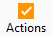

# Prospection

La prospection permet d’enregistrer les actions effectuées ou à venir 
 à l’attention des [clients](../../3/Client/ClientOngletActions.md), 
 des [prospects](../../2/Prospect/ProspectOngletActions.md) 
 et des [contacts](../../Contacts/4/OngletActions.md) (onglet 
 Actions).

## Ajout d’une action

L’enregistrement d’une action s’effectue soit pour un contact soit pour 
 un tiers, soit pour les deux lorsque l’un est rattaché à l’autre

 

Pour ajouter une action, il suffit de double-cliquer ou d’utiliser le 
 menu contextuel (Nouvelle) dans l’onglet Action de la fiche Contact ou 
 de la fiche Tiers ou de cliquer sur l’icône par la 
 barre d’outils.

 

Certaines actions comme les relances clients sont automatiquement générées 
 par le logiciel.

 

La liste des actions peut être triée par ordre de priorité.

