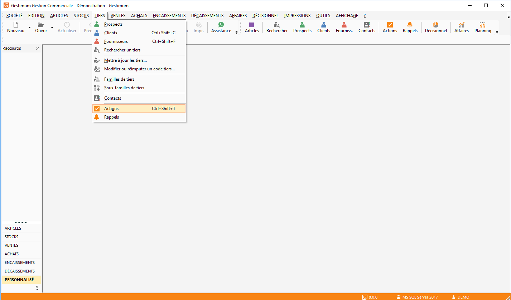

# Actions de A à Z

## Paramétrage

Avant de créer des actions, il faut définir certains paramétrages pour 
 bénéficier de tous les éléments.

 

Dans les tables de référence, on peut définir 
 plusieurs types d’action et lier la notion de "Rendez-vous", 
 on peut également paramétrer un rappel automatique avec délai pour voir 
 apparaître des "pop up" de rappel.

 

Le délai de rappel peut être indiqué en minutes, 
 heures, jours, mois et années.

 

Après avoir renseigné le délai et l'unité du 
 délai, cocher "Rappel automatique".

 
 

A la création d'une nouvelle action de ce type, 
 le rappel est automatiquement coché et la date et heure de rappel calculées 
 en fonction du délai paramétré. 

 

Si le délai n'est pas renseigné mais le rappel 
 automatique coché, le rappel est activé à la date et heure de début de 
 l'action.

 

Si le délai est renseigné mais le rappel automatique 
 n'est pas coché, le rappel n'est pas activé, en revanche lorsqu'on l'active 
 manuellement dans l'action, la date et heure de rappel sont calculées 
 en fonction du délai paramétré.

 

Il faut créer les salariés dans le menu SOCIETE/Salariés

Puis associer ce salarié à un utilisateur (via 
 SOCIETE/Utilisateurs).

 

La gestion des actions peut être liée au tiers 
 ou accessible directement depuis le menu TIERS/Actions.

Ou

 

Vous pouvez donc visualiser l’ensemble des actions 
 d’une personne ainsi que le descriptif.

 

Lors de la création de l’action (clic droit 
 nouveau), il faut mettre le type 
 de l’action, le nom du salarié, 
 cocher la case rappel pour que 
 le salarié obtienne à l’ouverture de GESTIMUM une fenêtre de rappel des 
 actions à faire et "l’état" qui permet de dire que l’action 
 est "en cours" ou bien par exemple "terminée" (l’état 
 terminée permet de clôturer l’action).

 

Le rappel d’actions s’affichera sur l’écran 
 de l’utilisateur associé au rappel.

 

Vous pouvez également glisser l’en tête dans 
 la partie grisée afin de procéder à un regroupement d’actions par type.

