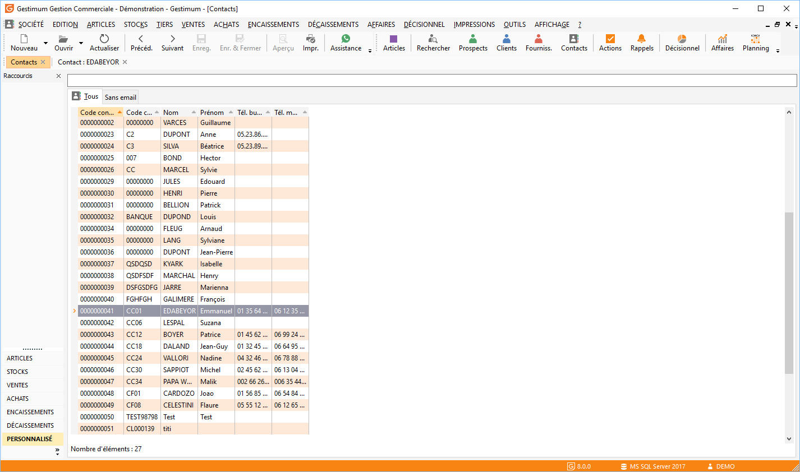

# Liste des contacts

La liste des contacts est accessible à partir du menu TIERS/Contacts, 
 ou directement à partir de l'onglet contacts de la barre de données.

 

 

Cette liste permet d’accéder à la gestion des contacts (création, modification, 
 suppression, impression).

 

Dans Gestimum, toutes les listes ont un fonctionnement commun.

