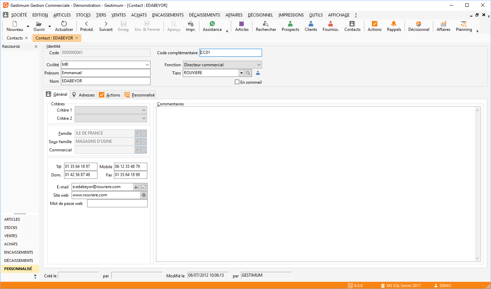

# Contact

Un contact est une personne pour qui vous souhaitez conserver des informations 
 administratives et/ou commerciales.

 

## Rattachement à un tiers

Rattacher un contact à un tiers permet d’intégrer automatiquement ce 
 contact et toutes les actions entreprises à l’attention de celui-ci dans 
 le suivi commercial du tiers.

 

Chaque fiche contact est composée des onglets [Général](OngletGeneral.md), 
 [Adresses](OngletAdresses.md) et [Actions](OngletActions.md) 
 Un [onglet supplémentaire](OngletPersonnalise.md) apparaît 
 si des [champs personnalisés](OngletPersonnalise.md) ont été 
 définis pour la Table Contacts.

