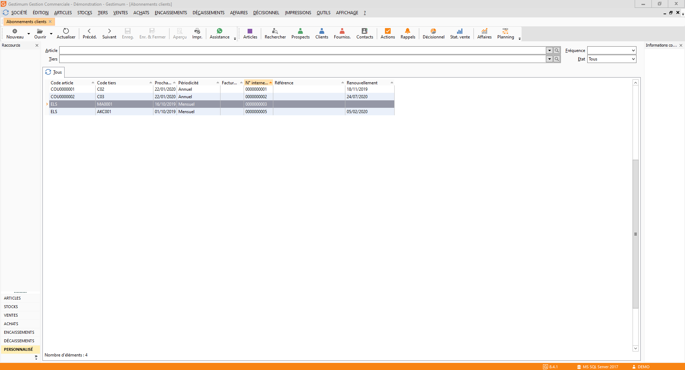

# Liste des abonnements clients

La liste des abonnements a un fonctionnement 
 commun à toutes les listes.

 

La gestion des abonnements (création, modification, 
 suppression, impression) s’effectue à partir de la barre d'outils, du 
 menu contextuel ou des raccourcis claviers.

 

Vous pouvez afficher la liste des abonnements 
 concernant un article et/ou un tiers particulier pour une fréquence précise. 
 La sélection de l’article et/ou du tiers peut s’effectuer par la liste 
 déroulante ou par une recherche précise.

 

