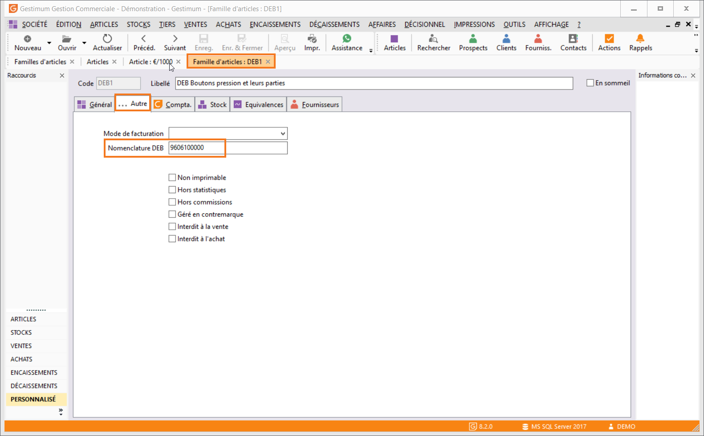
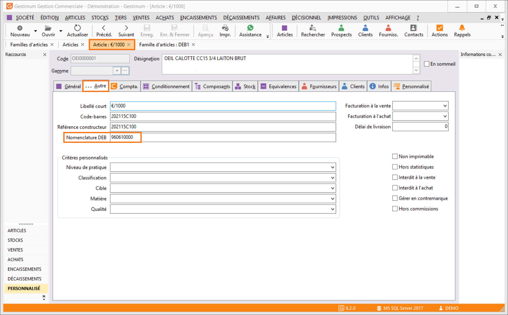
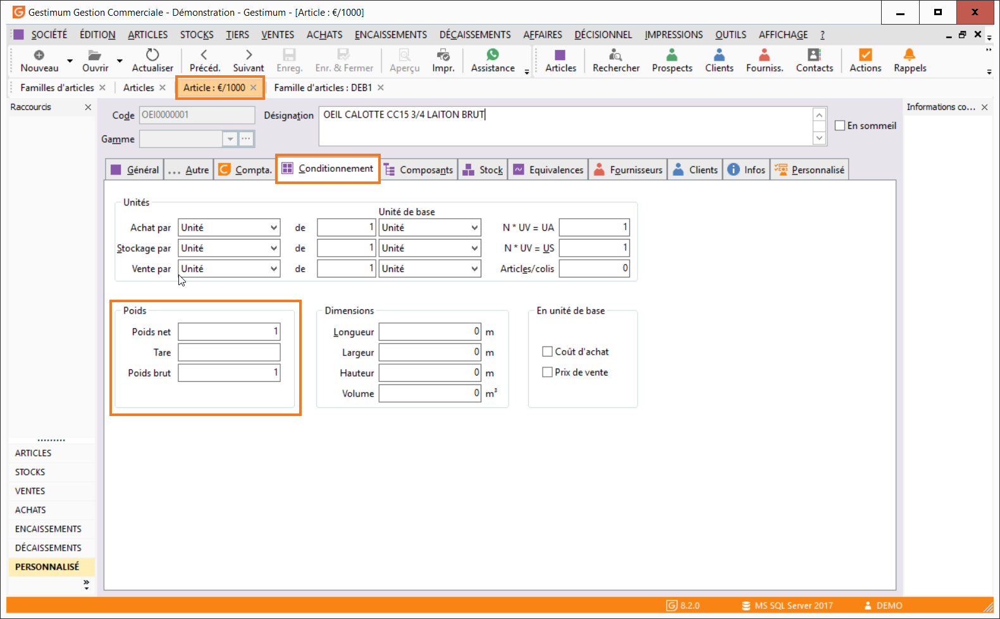

# Paramétrage des articles

Pour tous les articles à destination ou en provenance d’un autre pays 
 appartenant à la UE (Union Européenne), vous devez renseigner la Nomenclature 
 produit DEB  dans la fiche de la famille ou de la sous-famille article 
 (onglet Général) ou directement dans la [fiche 
 article](../../../Articles/1/Article/OngletAutre/ArticleOngletAutre.md) (onglet Autres).

 

Remarque
: Les articles de type "Service" 
 sont exclus de la DEB.

 

 

 

Vous devez également renseigner la [masse 
 nette](../../../Articles/1/Article/OngletAutre/ArticleOngletAutre.md) de l’article. Elle doit être indiquée en kilogramme pour une 
 unité de conditionnement de vente (Fiche Article, onglet Conditionnement). 
 Elle ne doit pas comprendre de décimale.

 

