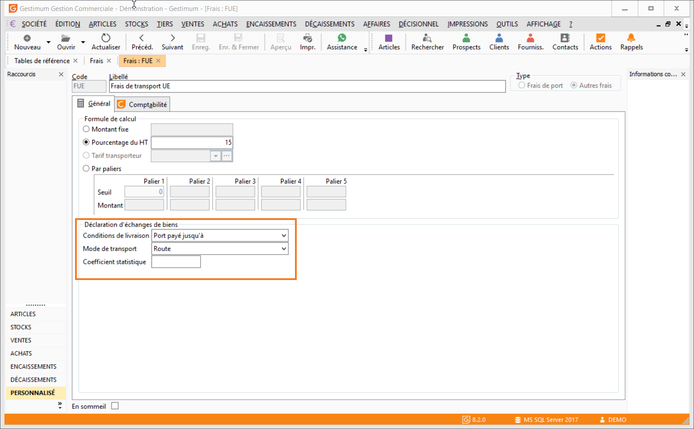

# Paramétrage des frais

Pour les déclarations de Niveau 1 ou 2, les [conditions de livraison](CodesConditionsLivraison.md) et le [mode de transport](CodesModesTransporst.md) sont des informations obligatoires qui doivent être renseignées dans la fiche des frais de type "Frais de port" (Frais du menu SOCIETE).

Dans ce cas, vous devez vous assurer que les éléments sont bien paramétrés dans les différents fais de port que vous utilisez dans vos documents. Ces éléments sont paramétrables dans l'onglet Général du frais.

 

 

Il faudra ensuite vérifier le bon paramétrage de la nature comptable

 

 

Remarque : le montant de frais de port de la partie achat n'est pas repris dans l'état préparatoire de la DEB. Seules les informations sur les Conditions de livraison et le Mode de transport sont reprises.

Si vous souhaitez que le montant remonte dans la valeur fiscale il faudra créer un article non géré en stock on y renseignant la nomenclature DEB « Port » par exemple.

 

