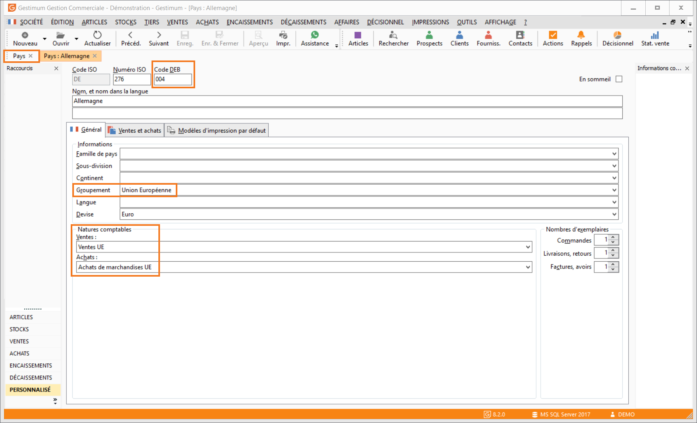

# Paramétrage des pays

Dans la liste des Pays accessible depuis le menu Société / Pays, vous devez affecter le groupement UE (Union Européenne) paramétré dans [les tables référence](ParametrageTablesRéférence.md) ainsi que le code DEB sur chaque fiche pays appartenant à l’Union Européenne.

 

 

 

 

