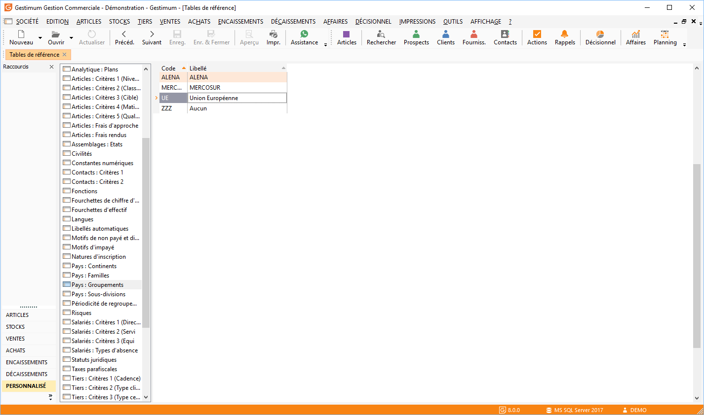

# Paramétrage des tables de référence

Dans les Tables de référence accessibles depuis le menu Société / Paramétrage, vous devez vérifier que dans la table "Pays : Groupements", le code UE (Union Européenne) soit créé, dans le cas contraire, vous devez le créer.

 

