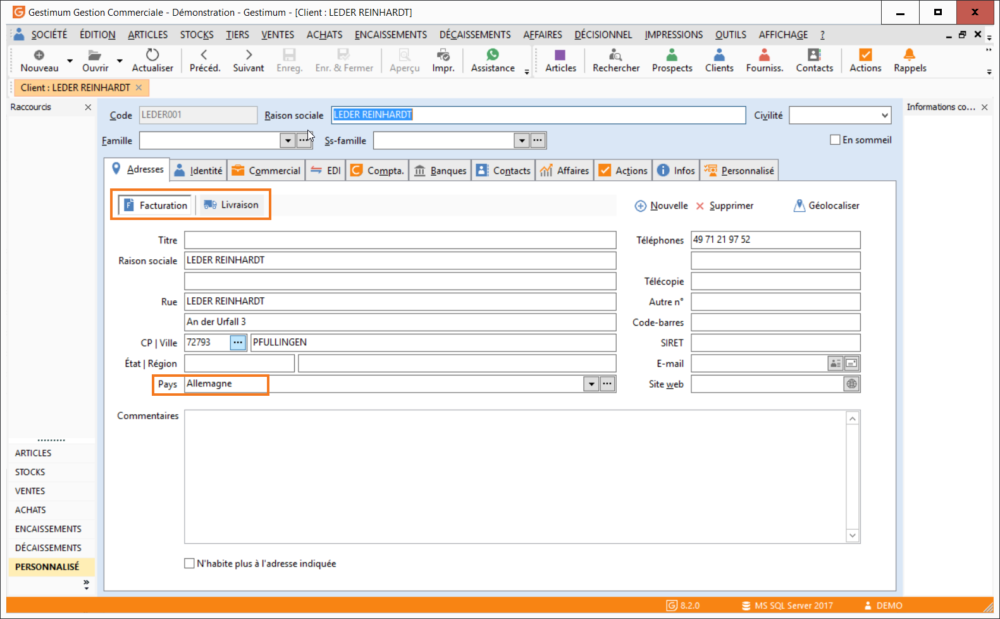
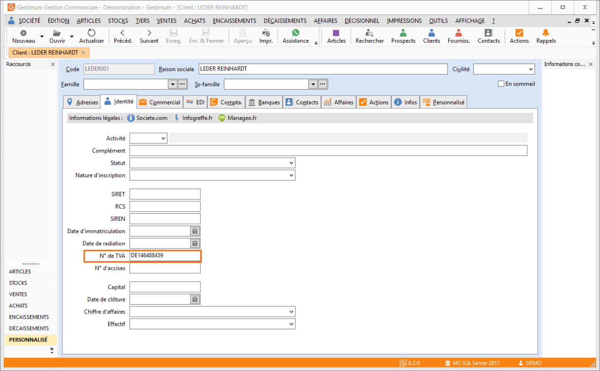
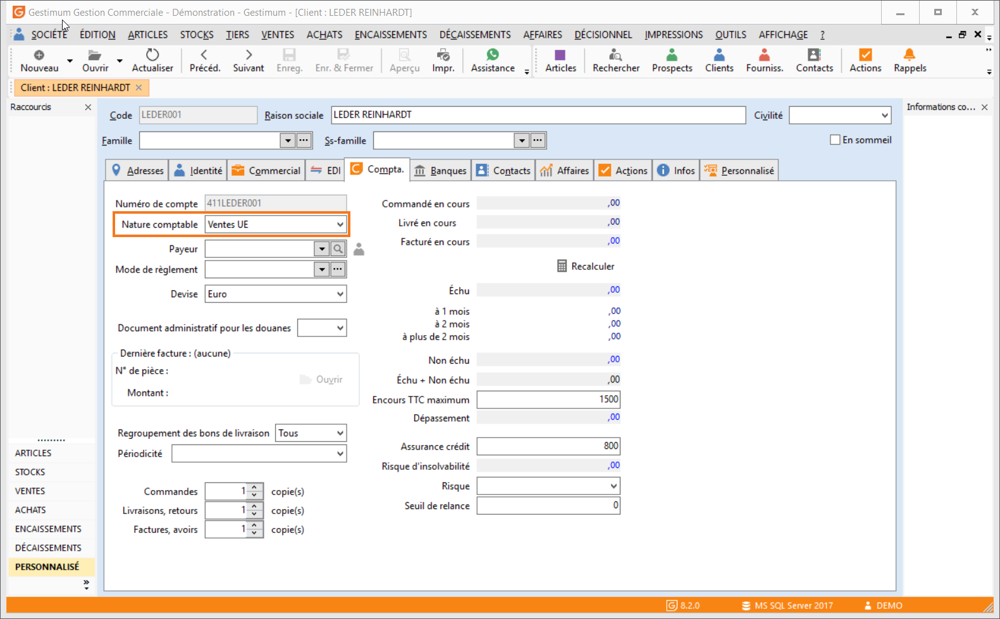

# Paramétrage des tiers

Plusieurs informations doivent être renseignées dans les fiches tiers (clients et  fournisseurs) concernés par les achats et ventes UE (Union Européenne) :

 

#### Le pays dans les différentes adresses du tiers :

 

#### Le n° de TVA intracommunautaire dans l’onglet Identité du tiers :

 

#### La nature comptable du tiers :

 

 

