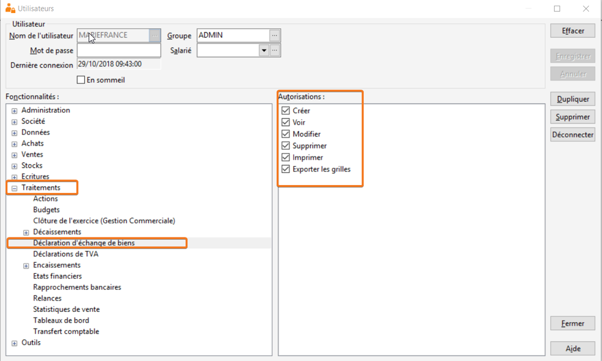

# Paramétrage des utilisateurs

Dans la gestion des droits Utilisateurs du menu Société,  vous devez donner les droits sur l’option "Traitements/Déclarations d’échange de biens" pour permettre à l'utilisateur d'accéder au traitement de la DEB.

 

