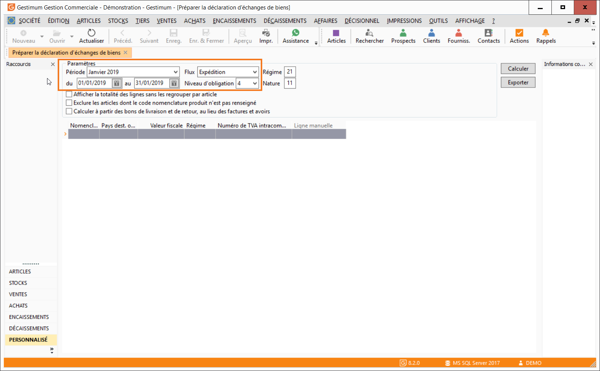

# Entête de l'état préparatoire

L' entête de l'état préparatoire est divisée en 3 parties :

* La période sur laquelle vous souhaitez calculer votre DEB,
* Le flux traité : Introduction (Achats) ou Expédition (Ventes),
* Le niveau d’obligation qui dépend du [montant de TVA déclaré](SeuilsDeclaration.md).

 

Le bouton Calculer génère une ligne par article sur la période de référence.

 

 

 

