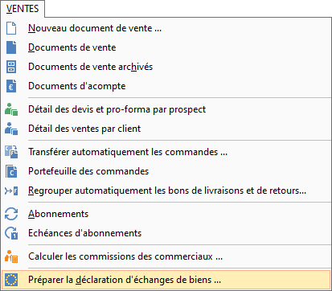
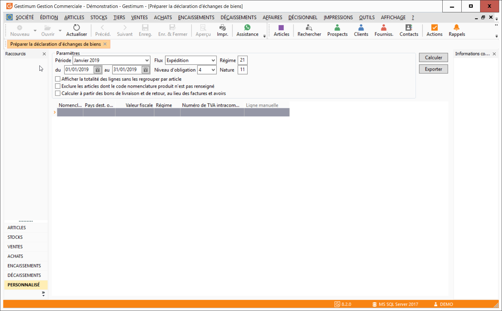

# Préparation de la déclaration d'échanges de biens

La préparation de la déclaration d'échanges de biens est accessible 
 depuis le menu VENTES | Préparer la déclaration 
 d'échanges de biens.

 

 

La fenêtre suivante s'ouvre :

 

 

Avant de lancer le calcul de la DEB en cliquant sur le bouton Calculer, 
 vous devez définir l’[entête](EnteteEtatPreparatoire.md) de 
 votre état.

