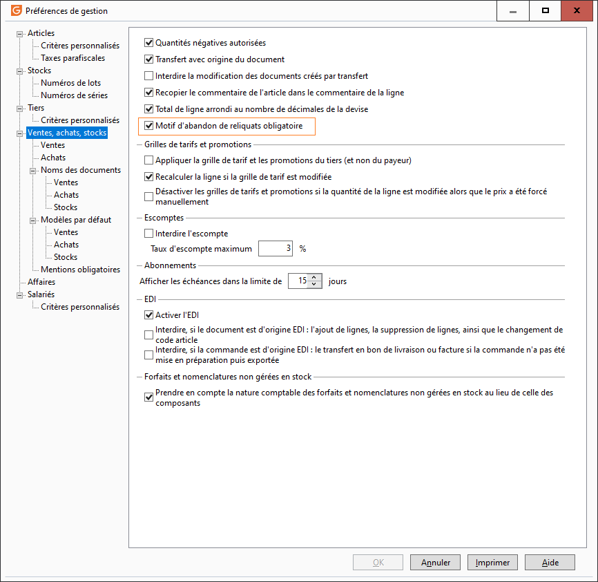
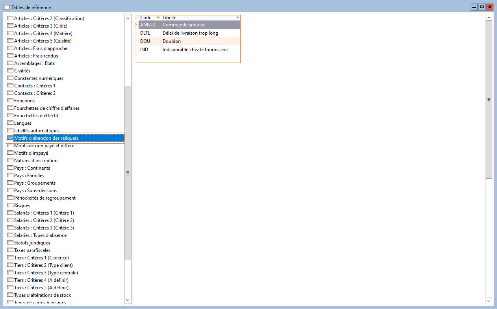
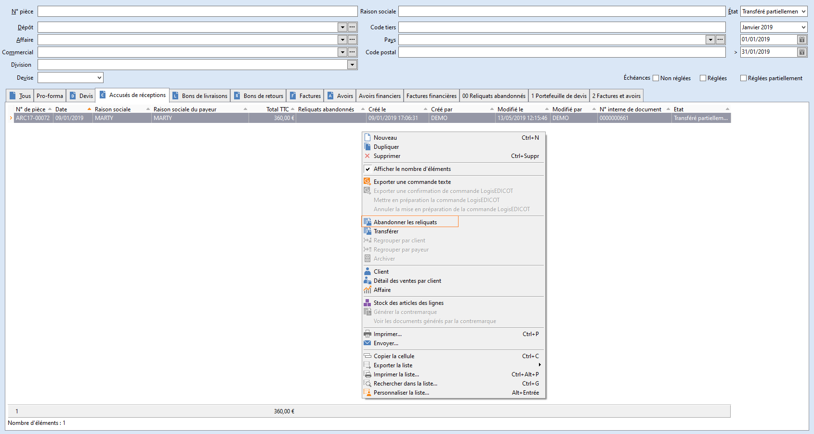
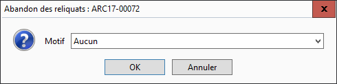
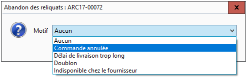
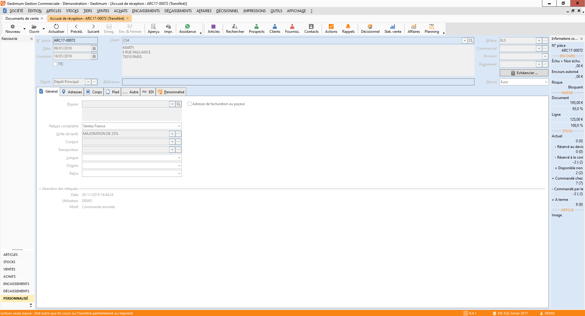

# Abandon des reliquats

Cette fonction est accessible uniquement pour les documents d’achat et de vente, de type commande, par clic droit depuis la liste des documents, ou le document lui-même.

 

Cette fonction permet de passer à l’état « Transféré », une commande client ou fournisseur portant un statut :

* En-cours
* Imprimée
* Transféré partiellement

tout en mettant à jour le stock réservé à la commande, le stock commandé et le stock à terme des articles gérés en stock contenus dans le document.

## Paramétrage

Dans les préférences de gestion, une option est disponible pour permettre de rendre obligatoire ou non la sélection du motif d’abandon des reliquats.

 

 

Par défaut, cette option est désactivée.

 

Les motifs d’abandon des reliquats sont personnalisables dans les tables de référence, accessibles depuis le menu SOCIÉTÉ | Paramétrage | Tables de référence.

 

La rubrique concernée porte le nom "Motifs d’abandon des reliquats".

 

 

Ici, vous pouvez librement créer les motifs d’abandon des reliquats en fonction de vos besoins.

## Utilisation

Afin d'effectuer un abandon de reliquat sur un document d’achat ou de vente, de type commande, effectuer un clic droit depuis la liste des documents ou l'en-tête du document, puis choisir "abandonner les reliquats :

 

 

La boite de dialogue suivante s’ouvre :

 

 

La sélection du motif d’abandon de reliquats s’effectue à l’aide du menu déroulant :

 

 

En cliquant sur "Annuler", la demande d'abandon des reliquats" sera abandonnée et le document ne changera pas de statut.

 

En cliquant sur "OK", le motif vient se renseigner dans l’onglet général du document.

 

 

Ces champs sont également affichables dans la liste des documents :

* Reliquats abandonnés (DOC\_ABRQ) : permet d’identifier les documents ayant fait l’objet d’un abandon de reliquats
* Reliquats abandonnés le (DOC\_ABRQLE) : permet d’identifier la date à laquelle l’abandon de reliquat a été effectué
* Reliquats abandonnés par (DOC\_ABRQPR) : permet d’identifier l’utilisateur ayant effectué l’abandon de reliquat

