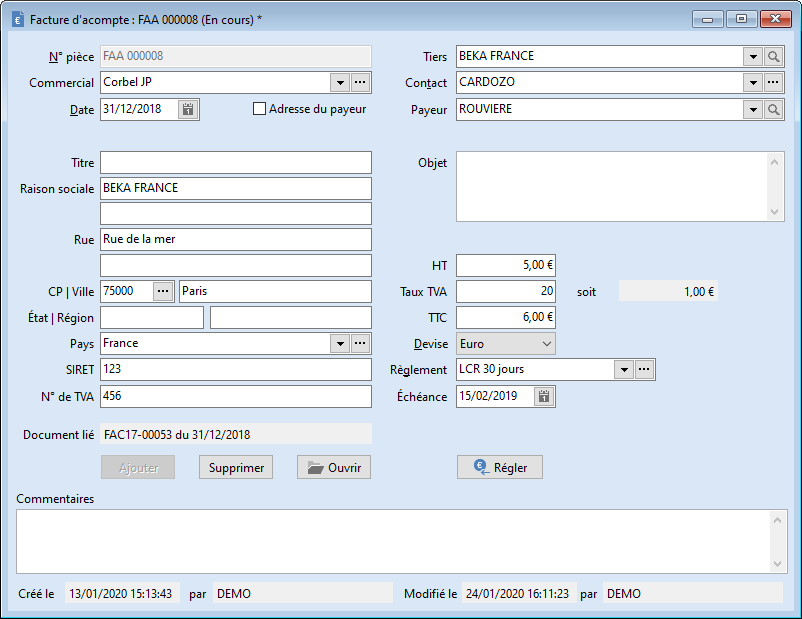

# Document d'acompte de vente

Les documents d'acomptes se présentent sur une seule page :

 

 

Vous devez obligatoirement renseigner les données suivantes  :

* la date de création de la pièce
* le client pour lequel vous réalisez ce 
 document
* la devise de réalisation du document
* l'adresse de facturation
* l'objet du document

 

Des informations complémentaires peuvent également être sélectionnées 
 :

* le numéro de pièce, si vous souhaitez avoir 
 un numéro différent des compteurs paramétrés dans les préférences 
 de la société
* le [commercial](../Fiche/0Entete/CommercialDocumentVente.md)
* le [mode 
 de règlement](../Fiche/0Entete/ModeReglementTiers.md)
* la date d'échéance

 

Il est possible lors de la saisie d'un 
 document de saisir directement un règlement. Il suffit de cliquer sur 
 l'icône  "Régler" pour vous permettre de 
 saisir et sélectionner les informations nécessaires à la validation du 
 règlement.  

 

Le document d'acompte 
 passera au statut comptabilisé, lorsque le règlement réceptionné sera 
 transféré en comptabilité.

 

La zone "Document lié", vous 
 permet de rattacher le document d'acompte au document de vente auquel 
 il fait référence. dans ce cas, le net à payer du document de vente rattaché 
 sera diminué du montant de l'acompte.

 

Un document d'acompte ne peut être rattaché 
 qu'à un document de vente. Par contre, un document de vente peut porter 
 N documents d'acompte.

 

Le menu contextuel donne accès :

* à la création d'un nouveau document
* à l’enregistrement de la pièce
* à la suppression de la pièce
* à la duplication de la pièce
* au module de paiement des échéances
* à la fiche du client
* à l’impression du document (avec choix 
 du modèle)
* à l'envoi du document par email

