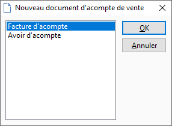

# Nouveau document d'acompte de vente

A partir de la liste des documents, plusieurs possibilités sont à votre 
 disposition :

* clic sur l’icône "Nouveau" de la barre d’outils
* raccourci clavier Ctrl + N
* utilisez la touche Inser
* créer à partir du menu contextuel "Nouveau"

 

A l’exception de la touche Inser, 
 toutes ces options sont également disponibles à partir de l’entête d’un 
 document.

 

L'accès à un nouveau document de vente propose à l'utilisateur de choisir 
 entre différents sous-types de documents :

* Facture
* Avoir

 

 

Une fois le choix confirmé, vous accédez automatiquement au document 
 choisi.

