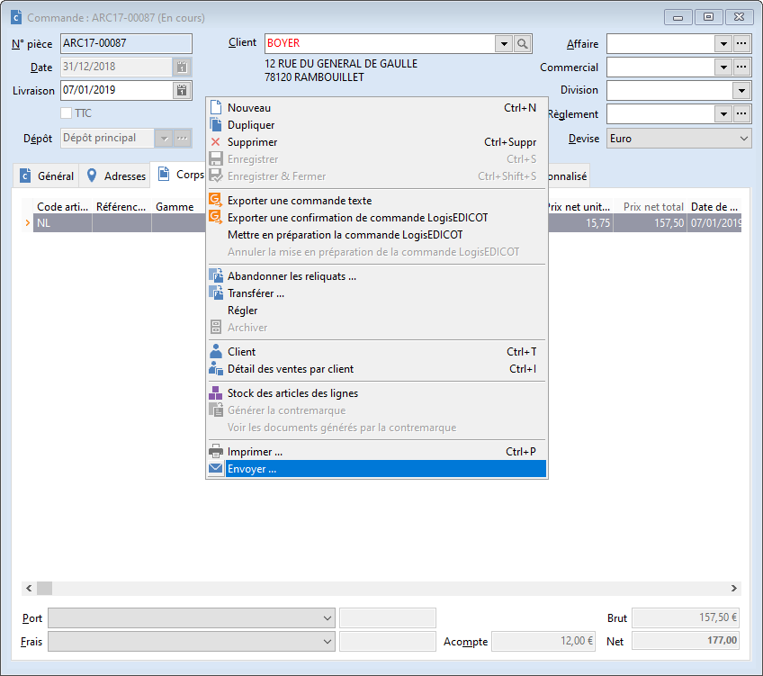
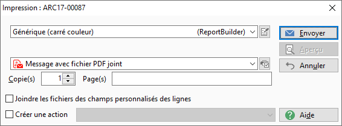
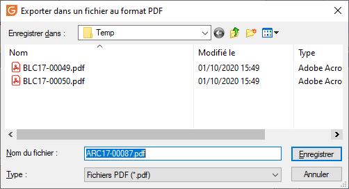
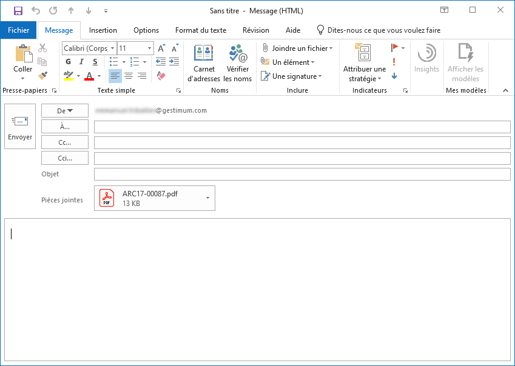

# Envoi par email depuis un document de vente

Un document de vente peut être imprimé dans un fichier au format PDF puis envoyé en pièce jointe d'un email.

 

Le point de départ est la commande "Envoyer" du menu contextuel dans un document ouvert :

 

 

Un modèle d'impression doit ensuite être sélectionné :

 

 

Puis un nom de fichier PDF est proposé par défaut. Il peut être modifié.

 

 

Enfin un nouvel email s'ouvre dans votre logiciel client de messagerie électronique, avec le fichier PDF en pièce jointe.

 

 

Il vous reste à rédiger l'email et à l'envoyer.

