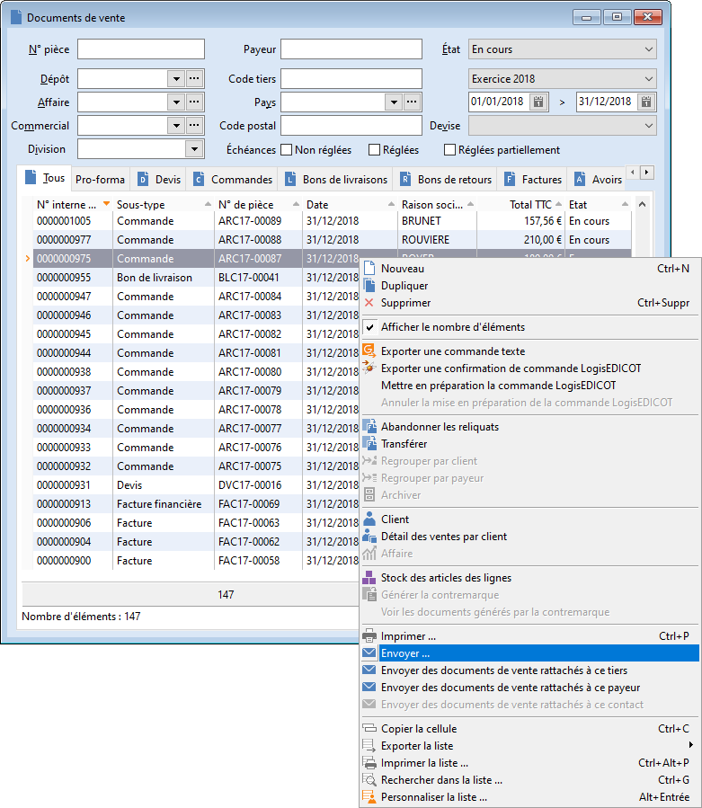

# Envoi par email depuis la liste des documents de vente

Un ou plusieurs documents de vente peuvent être imprimés dans des fichiers au format PDF puis envoyés en pièce jointe d'un email, via la commande "Envoyer" du menu contextuel dans la liste des documents de vente :

 

 

Après la sélection du modèle d'impression, le choix entre 3 possibilités doit être fait :

 

- soit envoyer seulement le document de vente sélectionné

  

 

- soit envoyer une série de documents de vente, dont les numéros de pièces se suivent

  

 

- soit envoyer l'ensemble des documents de vente de l'onglet sélectionné

 

 

Puis un dossier par défaut pour le stockage des fichiers PDF est proposé. Il peut être changé.

 

 

Enfin un nouveau message s'ouvre dans votre logiciel client de messagerie électronique, avec les fichiers PDF en pièces jointes :

 

 

Il vous reste à rédiger l'email et à l'envoyer.

 

