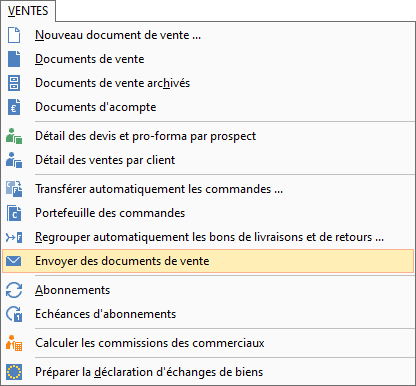
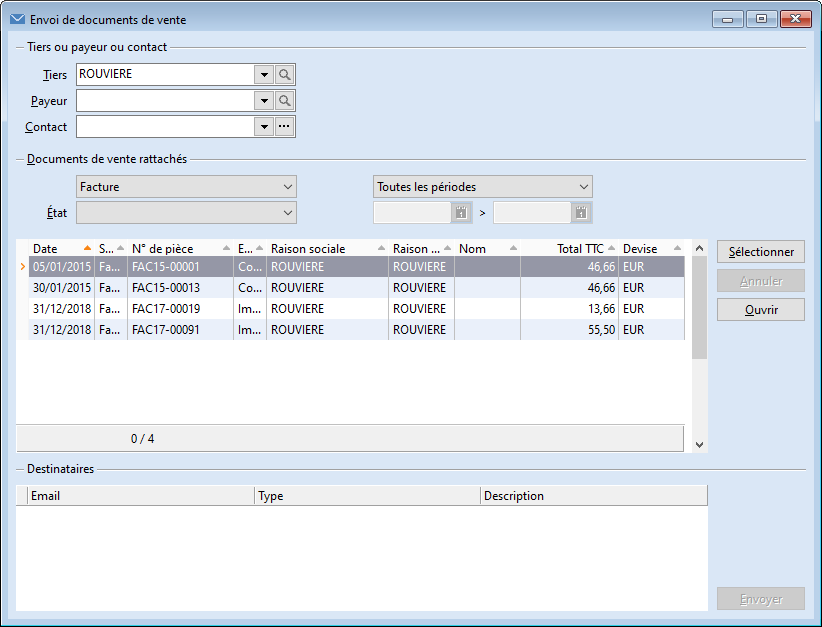
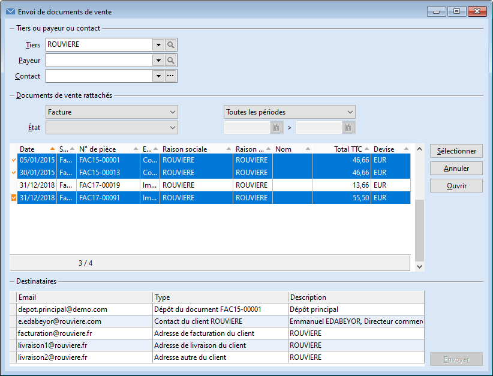
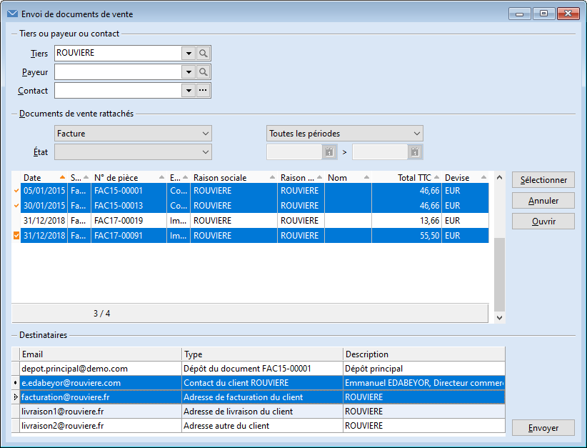
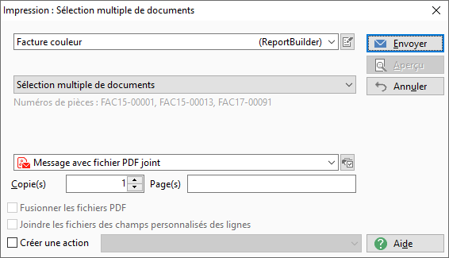
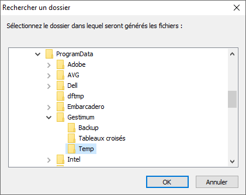
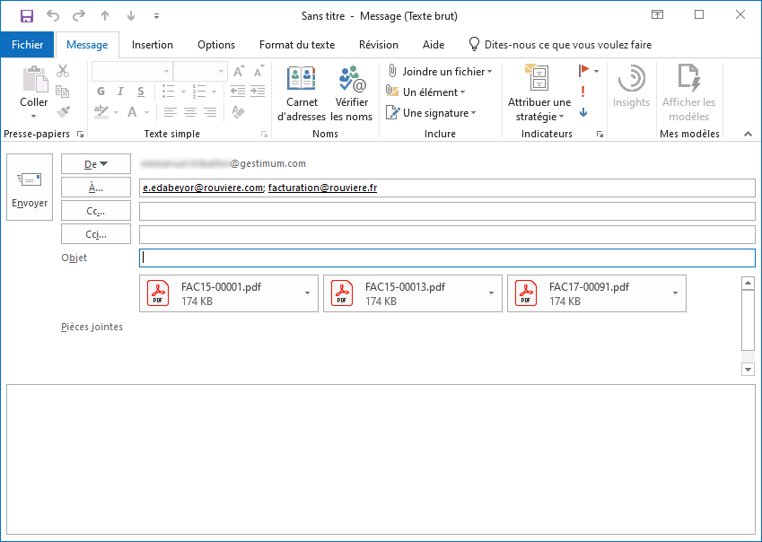

# Outil d'envoi de documents de vente par email

Ce nouvel outil disponible depuis la version 9.1 de Gestimum ERP permet d'envoyer plusieurs documents de vente par email, rattachés soit à un tiers, soit à un payeur, soit à un contact.

 

Les numéros de pièces à envoyer par email peuvent ne pas se suivre ici.

## Menu

L'outil est accessible via le menu VENTES | Envoyer des documents de vente.

 

## Utilisation

Dans un premier temps, un tiers, ou un payeur, ou un contact, doit être sélectionné.

 

 

Ensuite, les documents de vente à envoyer par email doivent être sélectionnés :

- soit un par un, à l'aide du bouton Sélectionner, ou de la touche Espace du clavier, ou de la combinaison Ctrl + Clic

- soit en bloc, après avoir cliqué sur le premier, avec la combinaison Shift + Clic

 

Il est aussi possible de tous les sélectionner d'un coup avec la commande Tout sélectionner du menu contextuel.

 

 

Puis les destinataires doivent être sélectionnés.

 

La liste des destinataires est constituée à partir de documents de vente sélectionnés, avec :

 

- l'adresse email du contact du document de vente (sélectionnée par défaut)

- l'adresse email des adresses du contact du document de vente

 

- l'adresse email des adresses du tiers

- l'adresse email des contacts du tiers

- l'adresse email des adresses des contacts du tiers

 

- l'adresse email des adresses du payeur

- l'adresse email des contacts du payeur

- l'adresse email des adresses des contacts du payeur

 

 

Le modèle doit aussi être sélectionné.

 

 

Un dossier de stockage des fichiers PDF est proposé. Il peut être changé.

 

 

Enfin un nouvel email s'ouvre dans votre logiciel client de messagerie électronique, avec les fichiers PDF en pièces jointes, et les destinataires choisis.

 

## Autres accès à l'outil

L'accès à ce nouvel outil est aussi possible depuis le menu contextuel de la liste des clients et le menu contextuel d'un client ouvert :

 

|  |  |

 

ainsi que depuis le menu contextuel de la liste des contacts et le menu contextuel d'un contact ouvert :

 

|  |  |

 

ainsi que depuis le menu contextuel de la liste des documents de vente :

 

|  |

