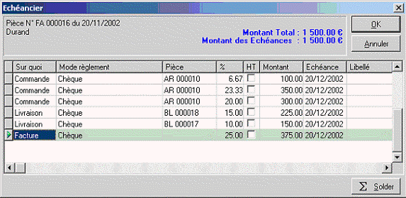

# Exemple d'échéancier fractionner suite à des transferts partiels

Prenons pour cet exemple, la réalisation d’un accusé réception pour 
 le client Durand pour la somme de 1500 €. Cette somme représente un accusé 
 réception  réalisé en TTC pour un article X avec une quantité de 
 150 dont le prix brut unitaire est de 10 €.

 

Remarques : Les différents documents ont été réalisé à la même date 
 avec les mêmes dates d’échéances.

 

Voici l’échéancier de base de l’accusé réception n° ARC17-00098.

## 1ère livraison partielle de 35 articles à 10 € soit un montant total 
 de 350 €

Le montant du BL est inférieur au montant de la 1ère échéance sur "Commande" 
 de l’Accusé Réception [900 €], donc l’échéance de 420 € se porte uniquement 
 sur cette ligne.

On obtient donc dans l’échéancier la ligne d’échéance suivante pour 
 le Bon de livraison n° BLC17-000052.

 

Une colonne "Transféré" est apparue dans l’échéancier de l’Accusé 
 Réception AR 000010 afin d’afficher le montant correspondant à l’échéance 
 transférée.

## 2ème livraison partielle de 10 articles à 10 € soit un montant total 
 de 100 €

Le montant du BL est inférieur au montant de l’échéance "Sur commande" 
 de l’Accusé Réception moins l’échéance déjà transférée lors du 1er BL 
 (BL 000013). [100 < (750-350)].

Donc l’échéance de 100 € se porte uniquement sur l’échéance de la ligne 
 "Commande".

 

On obtient donc dans l’échéancier la ligne d’échéance suivante pour 
 le Bon de livraison N° BL 000016.

 

Dans la colonne ‘Transféré’ de l’échéancier de l’Accusé Réception AR 
 000010, il y a donc 450 € qui correspondent à l’échéance affectée sur 
 le BL 000013 (350 €) + celle affectée sur le BL 000016 (100 €).

## 3ème livraison partielle de 45 articles à 10 € soit un montant total 
 de 450 €

Le montant du BL est supérieur au montant de l’échéance sur "Commande" 
 de l’Accusé Réception - les échéances déjà transférée lors du 1er BL (BL 
 000013) et du 2ème BL (BL 000016), mais, il est inférieur au montant de 
 l’échéance sur Livraison de l’Accusé Réception.

 

Donc l’échéance du BL 000017 se porte sur :

* La ligne Commande pour le solde de l’échéance sur commande initiale 
 : 300 € [750 350 100],
* La ligne Livraison pour le solde de l’échéance du BL 000017: 
 150 € [450 – 300] (450 € est le montant total du BL 000017 et 300 
 € est l’échéance sur "Commande" pour ce BL).

 

On obtient donc dans l’échéancier les lignes d’échéance suivantes pour 
 le Bon de livraison N° BL 000017.

 

Dans la colonne ‘Transféré’ de l’échéancier de l’Accusé Réception AR 
 000010, il y a donc :

* 750 € Qui correspondent à l’échéance affectée sur le BL 000013 
 (350 €) + celle affectée sur le BL 000016 (100 €) + le solde affecté 
 sur le BL 000017 (300 €),
* 150 € Qui correspondent à l’échéance affectée sur le BL 000017 
 (150 €).

## 4ème livraison partielle de 45 articles à 10 € soit un montant total 
 de 450 €

La première échéance "Sur Commande" de l’Accusé Réception 
 est totalement affectée.

Le calcul de l’échéancier du BL va donc s'effectuer sur les lignes suivantes 
 (ici les lignes Livraison et Facture).

 

Le montant du BL est supérieur au montant de l’échéance sur "Livraison" 
 de l’Accusé Réception - l’échéance sur livraison du BL 000017(150€), mais, 
 il est inférieur au montant de l’échéance sur Facture de l’Accusé Réception.

 

Donc l’échéance du BL 000018 se porte sur :

* La ligne Livraison pour le solde de l’échéance sur Livraison 
 initiale : 225 € [375 150] (375 € est le montant total sur Livraison 
 de l’Accusé Réception et 150 € est l’échéance sur "Livraison" 
 affecté pour le BL 000017),

* La ligne Facture pour le solde de l'échéance du BL 000018 : 
 225 € [450225] (450 € est le montant total du BL 000018 et 225 € est 
 l’échéance sur "Livraison" pour ce BL).

 

On obtient donc dans l’échéancier les lignes d’échéance suivantes pour 
 le Bon de livraison N° BL 000018

 

Dans la colonne "Transféré" de l’échéancier de l’Accusé Réception 
 AR 000010, il y a donc :

* 750 € qui correspondent à l’échéance affectée sur le BL 000013 
 (350 €) + celle affectée sur le BL 000016 (100 €) + le solde affecté 
 sur le BL 000017 (300 €),
* 375 € qui correspond à l’échéance affectée sur le BL 000017 
 (150 €) + celle affectée sur le BL 000018 (225 €),
* 225 € qui correspond à l’échéance affectée sur le BL 000018.

## 5ème livraison partielle de 15 articles à 10 € soit un montant total 
 de 150 €

En fait, ce transfert partiel solde les quantités à livrer pour l’AR 
 000010.

La deuxième ligne d’échéance "Sur Livraison" de l’Accusé Réception 
 est totalement affectée.

Le calcul de l’échéancier du BL va donc s'effectuer uniquement sur la 
 ligne "Facture".

Le montant de l’échéancier du BL est égal au montant de l’échéance sur 
 "Facture" de l’Accusé Réception – la ligne sur "Facture" 
 affectée sur l’échéanciers du BL 000018. [375 – 225]

Donc l’échéance du BL 000019 se porte sur La ligne "Facture" 
 pour 150 €.

On obtient donc dans l’échéancier la ligne d’échéance suivante pour 
 le Bon de livraison N° BL 000019.

 

Dans la colonne ‘Transféré’ de l’échéancier de l’Accusé Réception AR 
 000010, il y a donc une parfaite égalité avec la colonne "Montant" 
 :

* 750 € qui correspondent à l’échéance affectée sur le BL 000013 
 (350 €) + celle affectée sur le BL 000016 (100 €) + le solde affecté 
 sur le BL 000017 (300 €)
* 375 € qui correspond à l’échéance affectée sur le BL 000017 
 (150 €) + celle affectée sur le BL 000018 (225 €)
* 375 € qui correspond à l’échéance affectée sur le BL 000018 
 (225 €) + celle affectée sur le BL 000019 (150 €)

 

Suite au regroupement de tous les BL en une facture, on obtient l’échéancier 
 suivant :

* 1ère ligne 100 € : Échéance sur Commande pour le BL 000016,
* 2ème ligne 350 € : Échéance sur Commande pour le BL 000013,
* 3ème ligne 300 € : Échéance sur Commande pour le BL 000017 donc 
 750 € sur Commande,
* 4ème ligne 225 € : Échéance sur Livraison pour le BL 000018,
* 5ème ligne 150 € : Échéance sur Livraison pour le BL 000017 
 donc 375 € sur Livraison,
* 6ème ligne 375 € : Échéance sur Facture pour le BL 000018 et 
 le BL 000019 donc 375 € sur Facture.

 

L’échéancier général (appelé depuis le menu ENCAISSEMENTS/Échéances 
 à recevoir) pour le client Durand est le suivant :

* 1ère ligne 750 € : Échéance sur Commande pour la 1ère pièce 
 ayant ce "Sur quoi" l’AR000010,
* 2ème ligne 150 € : Échéance sur Livraison le BL 000017,
* 3ème ligne 225 € : Échéance sur Livraison le BL 000018 donc 
 375 € sur Livraison,
* 4ème ligne 375 € : Échéance sur la Facture finale FA 000016.

