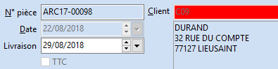

# En TTC

Tant qu'aucun payeur n'a été sélectionné. Seule la partie qui permet 
 de facturer HT ou TTC est accessible.

 

Cette option est principalement utilisée dans les échanges B2C.

 

Elle peut être initialisée par l’option "Facturé en TTC" provenant 
 de la fiche tiers. Mais est également activable 
 directement dans le document.

 

Par défaut la case "Facturé en TTC" est décochée. En cochant 
 la case "Facturé en TTC", les prix de vente des articles seront 
 considérés par le logiciel comme des prix TTC. Les montants HT et TVA 
 seront recalculés dans le pied du document, en partant du total des lignes 
 TTC et selon la nature comptable du document.

 

L'option TTC n'est plus désactivable dès 
 le premier enregistrement du document.

 

 

Le prix de vente de la fiche article est considéré comme un prix HT 
 ou TTC en fonction des Préférences de gestion/Ventes et Achats.

 

Exemple :

Pour un article avec un Prix d’achat de 50 €, un Prix de vente de 100 
 € et un dossier HT (Préférences de gestion /Ventes/HT cochée).

 

Lors de la création d’un document avec l’option TTC de cochée, le prix 
 de vente de l’article sera considéré comme un prix HT et à partir de là, 
 le prix TTC proposé à la ligne sera de 120 € avec TVA.

