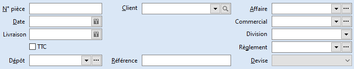

# Entête

 

Vous devez obligatoirement renseigner les données suivantes en entête 
 de document :

* la date de création de la pièce
* le dépôt sur lequel vous souhaitez que 
 le stock soit mis à jour
* le client pour lequel vous réalisez ce 
 document
* la devise de réalisation du document

 

Des informations complémentaires peuvent également être sélectionnées 
 :

* le numéro de pièce, si vous souhaitez avoir 
 un numéro différent des compteurs paramétrés dans les préférences 
 de la société
* la [date de 
 réception](DateReception.md) ou la date de livraison prévue (disponible sur les documents 
 de sous-type Commande et Demande de prix)
* exprimer les montants des lignes du document 
 [en TTC](EnTTC.md)
* l'affaire
* la division ou le [commercial](CommercialDocumentVente.md)
* le [mode 
 de règlement](ModeReglementTiers.md)
* la [référence](ReferenceDocument.md)

 

Le menu contextuel donne accès :

* à la création d'un nouveau document
* à l’ouverture de la liste des documents
* à l’enregistrement de la pièce
* à la suppression de la pièce
* à la duplication de la pièce
* à l'export du document en texte (seulement 
 pour les commandes)
* au transfert de la pièce (sauf pour les 
 factures et avoirs)
* au module de paiement des échéances
* à l'archivage de la pièce (lorsque celle-ci 
 est en état supprimé ou comptabilisé)
* à l’échéancier
* à la fiche du client
* aux détails des achats pour le fournisseur 
 sélectionner
* à l’état du stock de la commande
* à l’impression du document (avec choix 
 du modèle)
* à l'envoi du document par email

