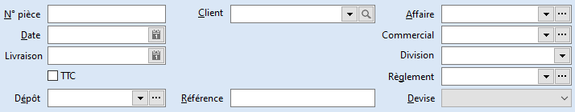
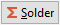

# Entête - Nouvelle

## N° pièce

S'alimente automatiquement en fonction des compteurs paramétrés dans les préférences de la société. Mais il est possible de le saisir manuellement.

## Date

Date d'émission du document. Par défaut, il s'agit de la date du jour.

## Livraison

Date de livraison calculée par défaut en fonction des préférences de gestion. Mais il est possible de la saisir manuellement.

## TTC

Cette option est principalement utilisée dans les échanges B2C.

 

Elle peut être initialisée par l’option "Facturé en TTC" provenant de la fiche tiers. Mais est également activable directement dans le document.

 

Par défaut la case "Facturé en TTC" est décochée. En cochant la case "Facturé en TTC", les prix de vente des articles seront considérés par le logiciel comme des prix TTC. Les montants HT et TVA seront recalculés dans le pied du document, en partant du total des lignes TTC et selon la nature comptable du document.

 

L'option TTC n'est plus désactivable dès le premier enregistrement du document.

## Client

L'appel de la liste des tiers est commune à toutes les listes. Cliquez sur l’icône  ou la touche F4 pour obtenir la liste déroulante des tiers. Une fonction de recherche est accessible par l’icône .

 

A l’appel du tiers, toutes les informations renseignées dans sa fiche et concernant le document sont automatiquement reprises (devise, adresse, mode de règlement, nature comptable, langue, ….).

 

Le tiers ne sera plus modifiable si dans l’échéancier du document, il existe au moins :

* soit une échéance réglée,
* soit une échéance antérieure au document en cours.

#### Encours dépassé

Lorsque l’encours du tiers est dépassé (fiche tiers + onglet Compta), le logiciel vous le signale et colore la zone (par défaut en rouge).

 

Remarque : Un tiers payeur/acheteur éventuel peut être précisé dans l’onglet Général.

## Affaire

Cette zone vous permet de rattacher le document à une affaire. On obtient alors un suivi détaillé de cette affaire depuis le module concerné.

 

Remarque : Il est également possible de renseigner l'affaire à la ligne de document, dans le cas où ce dernier contient des éléments relatifs à plusieurs affaires.

## Commercial

Le commercial associé au tiers du document est automatiquement proposé ; il reste modifiable.

La saisie du commercial est indispensable au calcul des commissions.

## Division

La saisie d’un code division (qui peut être associé à la fiche tiers) permet d’avoir un critère de regroupement supplémentaire dans les statistiques.

## Règlement

Le mode de règlement associé à la fiche du tiers du document (ou du tiers payeur) est automatiquement proposé ; il reste modifiable. Ce mode de règlement est important puisqu’il permet de générer les lignes d'échéances. Un icône à coté de ce champ vous permet d’accéder à l’échéancier du document.

 

Le mode de règlement ne sera plus modifiable si dans l’échéancier du document, il existe au moins :

* Soit une échéance réglée,
* Soit une échéance antérieure au document en cours.

## Échéancier

Par défaut, la date d’échéance est la date de réalisation de la pièce.

 

Si un mode de règlement est paramétré sur la fiche tiers, celui-ci sera repris automatiquement lors de la création de la pièce, ainsi vous aurez une ou plusieurs échéances créées automatiquement. Si un mode de règlement est affecté à la pièce, la date d’échéance sera calculée d’après le paramétrage de la fiche de celui-ci. Cette date reste toutefois modifiable.

 

L’échéancier permet de répartir les échéances de la pièce.

### Entête

L’échéancier reprend le numéro de la pièce, la date de réalisation de celle-ci et le nom du tiers concerné. Les montants totalisant la pièce et les échéances saisies sont également indiqués.

Lorsque le total des lignes d’échéances ne correspond pas au montant total de la pièce, la ligne "Montant des échéances" est en Rouge et vous n’avez pas la possibilité de sortir de la fenêtre tant que l’équilibre n’est pas établit (le bouton OK est grisé).

### Saisie des échéances

La saisie d’une ligne d’échéance consiste à sélectionner

* le domaine d’application de l’échéance
* le mode de règlement
* le pourcentage qui représente le montant de cette ligne d’échéance
* le montant de l’échéance
* la date d’échéance
* le commentaire de l’échéance (libellé)

 

La colonne Pièce sera renseignée automatiquement lors d’un transfert de pièce.

 

Par exemple : lorsque vous réaliser un échéancier sur une commande et que vous transférez celle-ci en bon de livraison/réception, la ligne de l’échéancier sur commande affichera dans la colonne "Pièce" le numéro de votre commande.

Lorsque vous avez plusieurs lignes d’échéance, le bouton  ou le raccourci clavier Alt+S, vous permet de solder votre dernière ligne d’échéance.

 

Le menu contextuel vous permet :

* d’insérer une échéance
* de supprimer une échéance
* d’ accéder à toutes les fonctions générales d'une grille

#### Domaine d’application

Suivant les pièces réalisées en ventes, vous avez la possibilité de créer un échéancier pour différents domaines.

 

Pour un Pro-forma ou un Devis, les domaines possibles sont :

* Avance
* Commande
* Livraison
* Facture

 

Pour un accusé de réception, les domaines possibles sont :

* Commande
* Livraison
* Facture

 

Pour un Bon de livraison ou de retour, les domaines possibles sont :

* Livraison
* Facture

 

Pour une Facture (financière ou non) ou un Avoir (financier ou non), le domaine possible est la Facture.

### Cas particulier

#### Saisie d’un acompte en pied de document

Lors de la saisie d’un acompte en pied de document, la fenêtre échéancier apparaît avec une ligne d’échéance représentant le montant de l’acompte, le reste étant sur la Facture par défaut.

 

De plus, cet acompte est matérialisé par  dans la colonne Acompte.

 

Lors de la saisie d’un acompte en pied de document de ventes, le domaine de la génération d’une ligne d’échéance varie suivant le document réalisé :

* Pour un Pro-Forma, un Devis, une Facture, un Avoir, le domaine de la ligne d’acompte est Avance,
* Pour un Accusé réception, le domaine de la ligne d’acompte est Commande,
* Pour un Bon de livraison, Bon de retour, le domaine de la ligne d’acompte est Livraison.

 

Attention : Si vous saisissez un acompte dans le document, nous vous conseillons de réaliser votre échéancier uniquement à l’ouverture de la fenêtre, en effet votre échéancier est modifié (recalculé) lors de la génération de la ligne d’échéance de l’acompte.

### Conséquence sur l’échéancier d’un document suite au règlement d’une échéance

Lors du règlement d’une échéance du document, le règlement est matérialisé par  dans la colonne réglé. Cela signifie que l’échéance n’est pas modifiable.

### Conséquence sur l’échéancier d’un document suite à la modification du document : Création d’une échéance négative

Si par la suite, vous effectuez une modification du document et que le total de ce document est inférieur au montant déjà réglé, un message vous informera qu’une échéance négative a été créée pour la différence entre le montant initial du document (montant réglé) et le montant après modification.

### Transfert partiel d’un Accusé Réception

Lors d’un transfert partiel d’un Accusé Réception , la fenêtre Échéancier évolue en fonction du montant livré.

Suite à un transfert partie l’échéancier de l’Accusé Réception affiche une colonne supplémentaire qui indique le montant transféré. Cette colonne évolue en fonction des transferts effectués.

Lorsque le document est transféré entièrement (il est alors en état Transféré), les montants de la colonne "Transféré" sont identiques aux montants de la colonne "Montant"

## Devise

La devise associé au tiers payeur (à défaut celle du tiers du document) est automatiquement proposé; elle reste modifiable. Ce choix est important puisque les prix des articles seront dans cette devise.

 

La devise ne sera plus modifiable si dans l’échéancier du document, il existe au moins :

* Soit une échéance avec un acompte,
* Soit une échéance avec retenue (uniquement pour les facture),
* Soit une échéance réglée,
* Soit une échéance antérieure au document en cours.

## Menu contextuel de l'En-tête de document

 

Un clic droit dans l'en-tête du document ouvre un menu contextuel donnant accès :

 

* à la création d'un nouveau document
* à l’ouverture de la liste des documents
* à l’enregistrement de la pièce
* à la suppression de la pièce
* à la duplication de la pièce
* à l'export du document en texte (seulement pour les commandes)
* au transfert de la pièce (sauf pour les factures et avoirs)
* au module de paiement des échéances
* à l'archivage de la pièce (lorsque celle-ci est en état supprimé ou comptabilisé)
* à l’échéancier
* à la fiche du fournisseur
* aux détails des achats pour le fournisseur sélectionner
* à l’état du stock de la commande
* à l’impression du document (avec choix du modèle)
* à l'envoi du document par email

