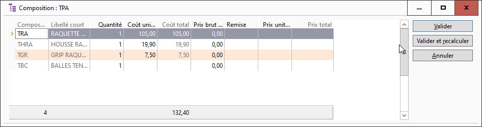

# Composition de la nomenclature ou du forfait

La fenêtre vous est proposée à partir du menu contextuel de la grille de saisie des document de ventes :

 

 

Elle va permettre de mettre à jour pour chaque composant :

* la quantité
* le coût unitaire
* le prix brut unitaire
* la remise
* le prix net unitaire

 

