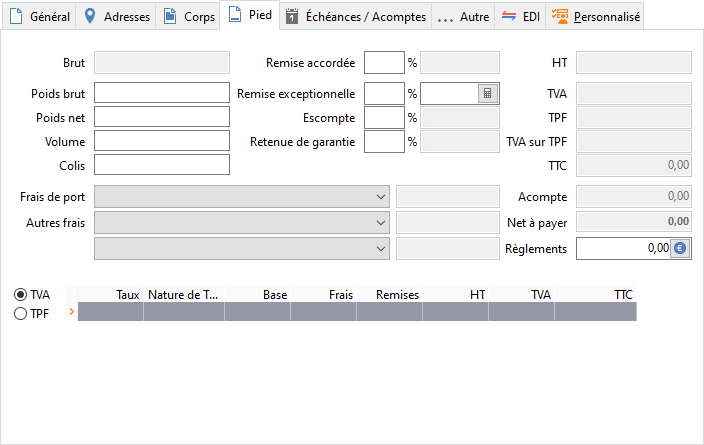

# Pied

Le pied contient toutes les informations concernant la totalisation du document (total brut, remise sur pied, frais de port, frais divers, total TVA).

 

## Brut

Le brut se calcule automatiquement à partir des lignes d’articles :

 

Prix Net \* Quantité

## Poids brut, poids net, volume et colis

Les totaux en poids brut, poids net, volume et nombre de colis sont renseignés en fonction des informations saisies sur les lignes articles dans l’onglet général du document.

## Remise accordée

La remise accordée s’applique sur le total brut.

 

Lorsque vous avez paramétré la fiche tiers avec un taux de remise pour un montant minimum du brut de la pièce réalisée, le titre du champ affiche le montant minimum pour avoir la remise. Ensuite, il révèle automatiquement le taux et la remise calculée si le seuil est atteint.

## Remise sur exceptionnelle

La remise exceptionnelle est une remise que vous octroyez ponctuellement à un tiers. Elle s’applique sur le total brut moins la remise accordée.

## Escompte accordé

L’escompte accordé s’applique sur :

 

Brut + (Port + frais + Frais supplémentaire) - (Remise accordée + Remise sur facture)

 

Il est paramétrable sur les fiches tiers (Onglet Commercial) à la hauteur de celui défini dans les préférences de gestion (Onglet Ventes et achats).

 

L'escompte est ici considéré comme un escompte commercial, par conséquent il est pris en compte dans le calcul de la marge.

## Retenue de garantie

La retenue de garantie s’applique sur le TTC. Ce champ est saisissable uniquement sur les factures.

## Frais de port

Cette zone est commune aux onglets Corps et Pied de document.

 

La liste déroulante permet de sélectionner l’un des frais de type Frais de port, définis dans le menu SOCIETE | Frais.

 

Le montant est saisissable uniquement lorsque le frais est de type Montant fixe (sans montant).

 

Un frais de port peut être associé directement dans la fiche du tiers (Onglet Commercial), il est alors proposé automatiquement en réalisation du document.

## Autres frais

Cette zone est commune aux onglets Corps et Pied.

 

La liste déroulante permet de sélectionner l’un des frais de type Autres frais définis dans le menu SOCIETE | Frais.

 

Le montant est saisissable uniquement lorsque le frais est de type Montant fixe (sans montant).

 

Un frais peut être associé directement dans la fiche du tiers (Onglet Commercial), il est alors proposé automatiquement en réalisation du document.

## Autres frais supplémentaires

La liste déroulante permet de sélectionner un frais de type Autre Frais, définis dans le menu SOCIETE | Frais. Le montant est saisissable uniquement lorsque le frais est de type Montant fixe (sans montant). Un frais supplémentaire peut être associé directement dans la fiche du tiers (Onglet Commercial), il est alors proposé automatiquement en réalisation du document.

## Total HT

Le total HT est automatiquement calculé à partir du montant brut + port + frais - remises indiqués.

## Total TVA, Total TPF et TVA sur TPF

Le montant de TVA et de TPF dépend de la nature comptable du tiers, du taux de chaque article et frais et du taux éventuellement indiqué dans les lignes d’articles. Le détail de ces montants est affiché en pied de cet onglet.

## Total TTC

...

## Acompte

La saisie d’un acompte diminue d’autant le net à payer du document. Cette zone est commune aux onglets "Corps" et "Pied".

 

La saisie de l’acompte s’effectue dans l’onglet "Corps" et est automatiquement recopié dans l’onglet "Pied" du document.

 

Remarque : A la saisie d’un acompte, votre échéancier est revu avec une ligne d’échéance créée pour que vous puissiez saisir le règlement correspondant à cet acompte.

 

[Régler un acompte depuis le document de vente](ReglerAcompteDepuisDocumentVente.md)

## Net à payer

Le net à payer se calcule automatiquement suivant la formule classique :

 

Brut + Port + Frais + Frais supplémentaires - Remise accordée - Remise sur Facture - Escompte accordé + TVA + TPF - Acompte

## Règlements

[Règlement depuis le document de vente](ReglementDepuisDocumentVente.md)

## TVA et TPF

Vous avez la possibilité de voir le détail du montant de la TVA ou de la TPF en cliquant sur le bouton "TVA" ou "TPF" correspondant.

 

Pour la TVA, par défaut, les colonnes "Taux", "Type", "Base", "Frais", "Remise", "H.T.", "T.T.C." sont présentes.

 

Pour la TPF, par défaut, les colonnes "Taux", "Mode calcul", "Taux T.V.A.", "Base", "Remise", "Taxe", "TVA" sont présentes.

 

D'autres colonnes sont disponibles par le menu contextuel de ces listes.

