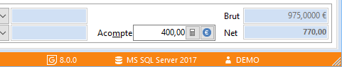
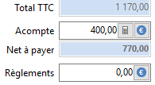
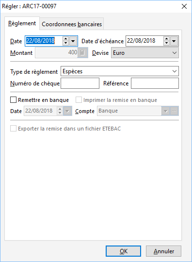

# Régler un acompte depuis le document de vente

Une nouvelle fonctionnalité a été ajoutée afin d’enregistrer le règlement d’un acompte directement depuis le document.

 

Après avoir saisie un acompte dans le document un nouvel accès  apparaît dans la zone Acompte.

 

Cet accès  est également présent dans la zone Acompte en pied de document.

 

En cliquant sur cet accès (…) vous accédez directement à la fenêtre de règlement de l’échéance d’acompte.

 

Vous pouvez ainsi enregistrer la réception du règlement de l’acompte.

