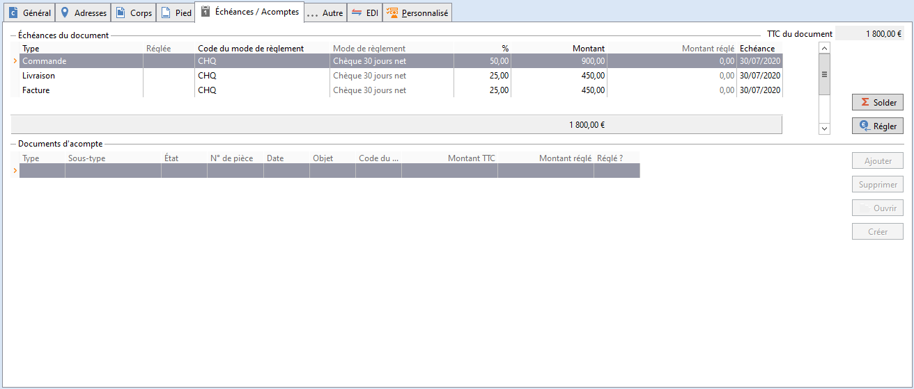
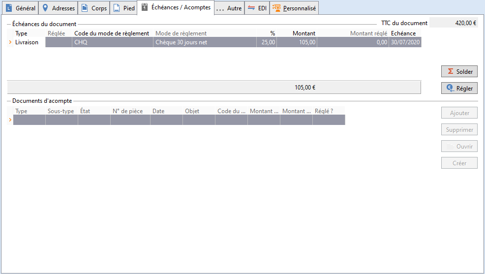
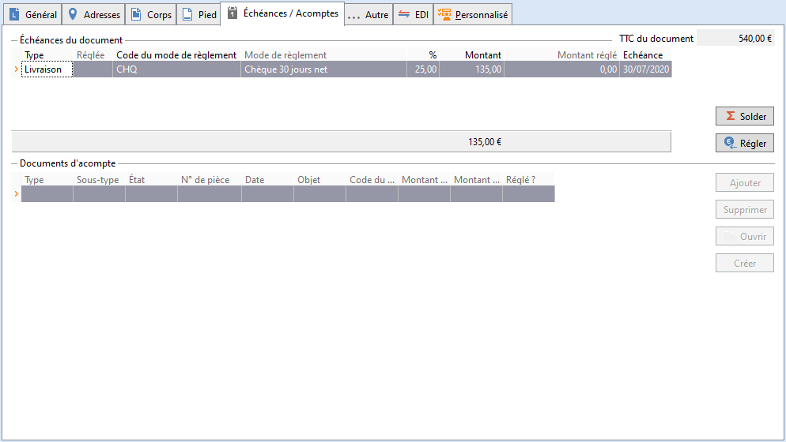
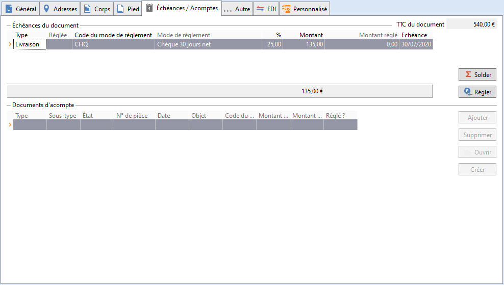
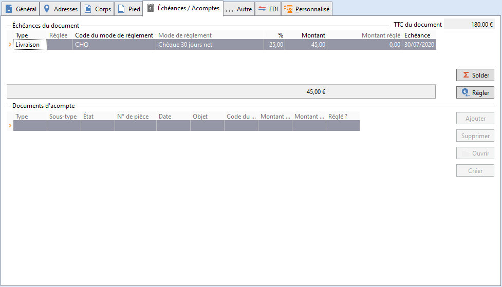
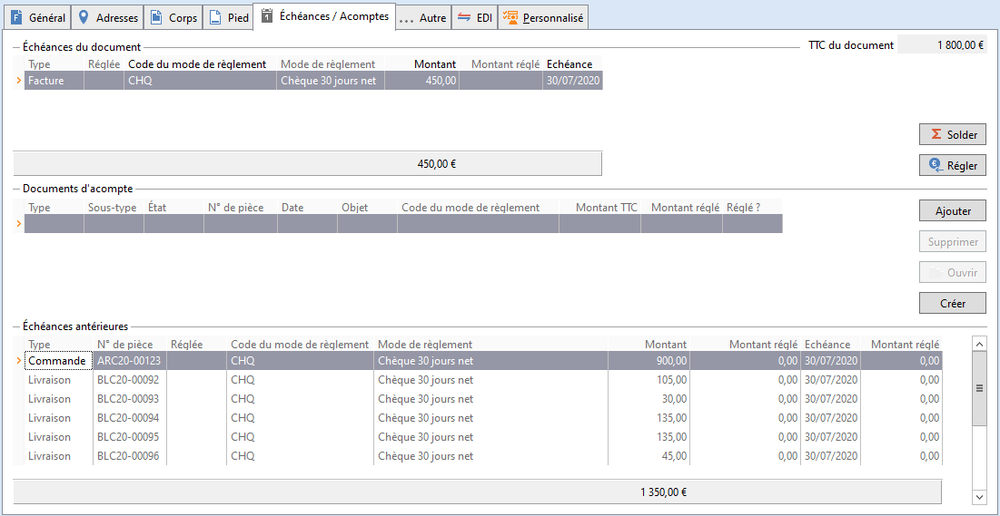
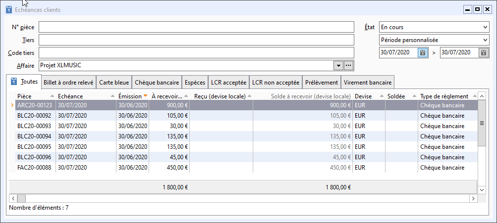
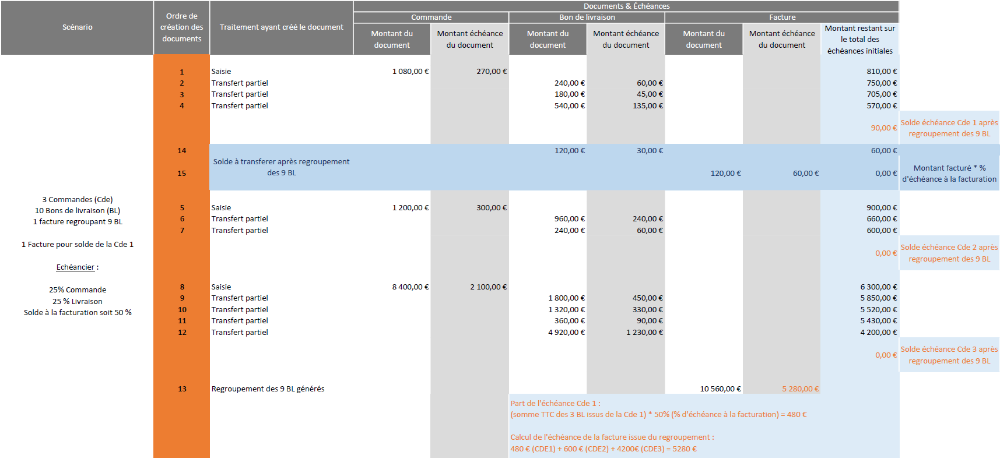

# Echéances et acomptes

A partir de la version 9, le montant des échéances des documents de 
 vente d’origine ne sont plus transférés partiellement. 

Chaque document est propriétaire de son ou ses échéances. Seule la facture 
 finale portera les échéances des documents qui lui sont rattachés, en 
 plus de ses propres échéances.

 

Pour cela, l’échéancier du document est présenté sous la forme d’un 
 onglet "Échéances / Acomptes" dans le document, qui comporte 
 3 zones distinctes :

• Échéances du document : correspond aux échéances du document en-cours

• Documents d’acompte : factures et avoirs d’acompte rattachés au document

• Échéances antérieures : correspond aux échéances des documents antérieurs

 

Remarque : il n'est pas possible de cumuler 
 l'utilisation du multi-échéances et des documents d'acomptes

 

Les critères de regroupement des échéances sont les suivants : 

* La date d'échéance
* Le type d'échéance
* Le mode de règlement

 

Dans l'échéancier du document, le calcul de la date d'échéance, s'effectue 
 de la manière suivante :

* Si un mode de règlement est sélectionné : la date se calcule en 
 fonction du paramétrage présent dans le mode de règlement
* Sinon c'est la date du document qui est reprise par défaut

## Exemple

Prenons pour exemple, un échéancier fractionné suite à des transferts 
 partiels.

### Réalisation d’un accusé de réception pour le client Durand pour la 
 somme de 1 500 € HT.

Cette somme représente un accusé de réception réalisé en TTC pour un 
 article X, avec une quantité de 150 dont le prix brut unitaire est de 
 10 € soit un montant TTC de 1 800 €.

 

Remarque : Les différents documents ont 
 été réalisé à la même date avec les mêmes dates d’échéances.

 

Voici l’échéancier de base de l’accusé de réception : 

 

### 1ère livraison partielle 
 de 35 articles à 10 €

soit un montant HT de 350 € et de 420 € TTC. On obtient l’échéancier 
 suivant soit 25% de 420 € = 105 €.

 

### 2ème livraison partielle 
 de 10 articles à 10 €, soit un montant HT de 100 € et de 120 € TTC

On obtient l’échéancier suivant soit 25% de 120 € = 30 €.

 

### 3ème livraison partielle 
 de 45 articles à 10 €, soit un montant HT de 450 € et de 540 € TTC.

On obtient l’échéancier suivant soit 25% de 540 € = 135 €.

 

### 4ème livraison partielle 
 de 45 articles à 10 €, soit un montant HT de 450 € et de 540 € TTC

On obtient l’échéancier suivant soit 25% de 540 € = 135 €.

 

 

### 5ème livraison partielle 
 de 15 articles à 10 €, soit un montant HT de 150 € et de 180 € TTC

On obtient l’échéancier suivant soit 25% de 180 € = 45 €.

 

 

 

Ce dernier transfert solde l’accusé de réception d'origine.

### Résultat

Suite au regroupement des 5 Bons de Livraison, on obtient l’échéancier 
 suivant dans la facture :

 

 

Détail des échéances remontées sur la facture d’un montant de 1800 € 
 TTC après regroupement :

• Échéance du document FAC17-00238 : 25% de 1800 € = 450 €

• Échéances antérieures : 1350 € réparties sur 6 documents

 

L’échéancier du client Durand, accessible via le menu ENCAISSEMENTS 
 | Échéances à recevoir est le suivant :

 

## Regroupement de documents multi-échéances

Il est possible d’effectuer un regroupement de documents portant chacun 
 un paramétrage multi-échéances différent. 

 

Voici un exemple de regroupement ainsi que les différentes explications 
 de calculs effectués lors des différents regroupements et transferts de 
 documents :

 

Pour plus de détails, consulter les [Schémas 
 de fonctionnements des échéances et documents d'acompte](SchemaFonctionnementEcheances/SchemaFonctionnementEcheancesAcomptes.md).

 

