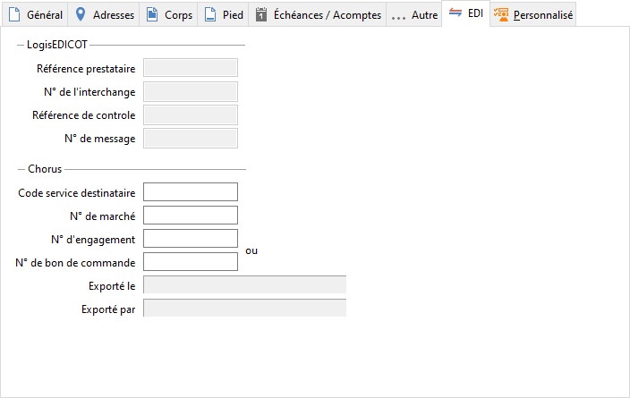

# EDI

La gestion des documents EDI issus d'un import comportent de références 
 d'identification EDI qui permettent de suivre la traçabilité de documents 
 et des articles.

 

## LogisEDICOT

### Référence prestataire

Référence interne prestataire EDI (DOC\_EDICOT), il peut s'agir du partenaire 
 EDI qui gère les transactions.

### Numéro de l'interchange

Numéro d'interchange EDI (DOC\_REFEDI)

### Référence de contrôlé

Référence de contrôle d’échange EDI (DOC\_EDICTR)

### Numéro de message

N° de document client donnée par l’émetteur de la commande EDI (DOC\_EDINDC)

## Autres éléments

Les éléments suivants sont également renseignés lors de l'import et 
 s'affichent dans cet onglet :

- Traitement ayant généré le document : "Import EDI"

- Etat du document sera initialisé à "En cours"

- Origine : Champ renseigné lors de l’import, disponible dans l’onglet 
 Infos

## Chorus

### Code service destinataire

### Numéro de marché

### Exporté le

### Exporté par

