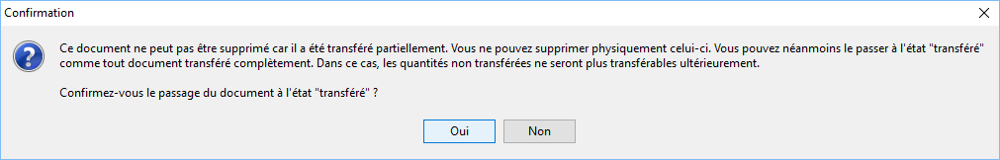

# Suppression d'un document de vente à l'état "Reliquat"

Un document est en état "reliquat" à la suite d’un [transfert 
 partiel de document](../../TransfertDuplicationDocument/2/TransfertPartielDocumentVente.md).

 

Vous avez la possibilité de solder les reliquats d’une commande/accusé 
 réception qui sont considérés non livrables ou pour lesquels le client 
 ne souhaite finalement pas être livré. 

 

Pour cela, vous devez sélectionner le document en état reliquat et demander 
 la suppression du document.

 

Vous obtenez un message de confirmation :

 

