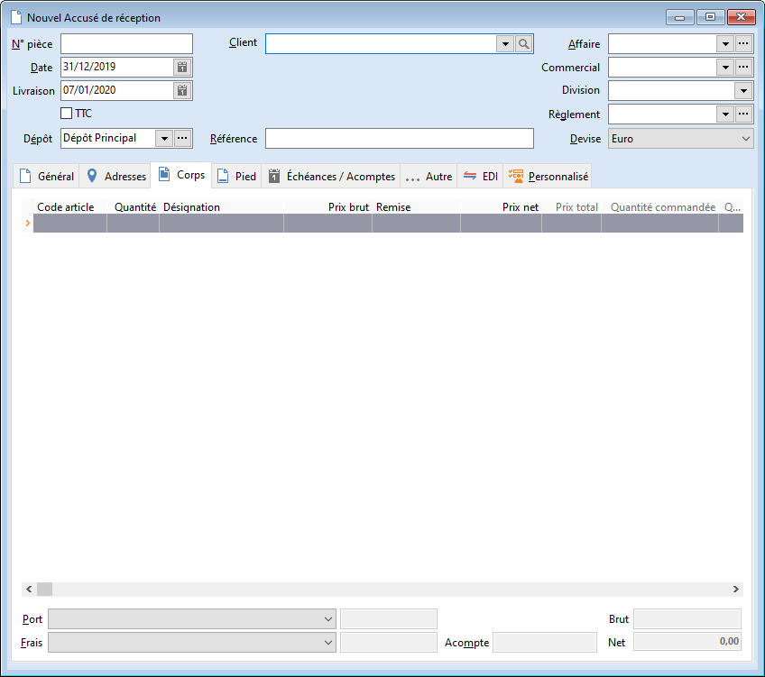

# Nouvel Accusé de réception

L’accusé de réception enregistre la commande du client. Les quantités 
 dans le champ Commande client sont mises à jour.

 

En réalisation du document, la date de livraison est calculée à partir 
 du délai de livraison général (voir les préférences de la gestion). Vous 
 pouvez également définir un délai de livraison particulier pour un article 
 (voir Fiche Article\onglet Autres), dans ce cas le logiciel recalcule 
 automatiquement la date prévue de livraison en prenant en compte le délai 
 le plus grand.

 

La date prévue de livraison comme la date de commande servent en affectation 
 des commandes (voir Affectation des commandes) pour générer les bons de 
 livraison selon un ordre précis.

 

L’en-cours maximum du client est calculé à partir du "Dépassement" 
 présent sur la fiche tiers (onglet Compta) et des options paramétrées 
 dans les Préférences de Gestion/Tiers/calculer l'Encours à partir du Facturé/Livré/Commandé.

 

En validation de l’accusé, si le montant de la pièce est inférieur au 
 minimum de commande défini dans les préférences de la gestion, un message 
 vous le signale.

 

L’accusé de réception met à jour le stock théorique « à terme » 
 et le stock des commandes clients.

 

