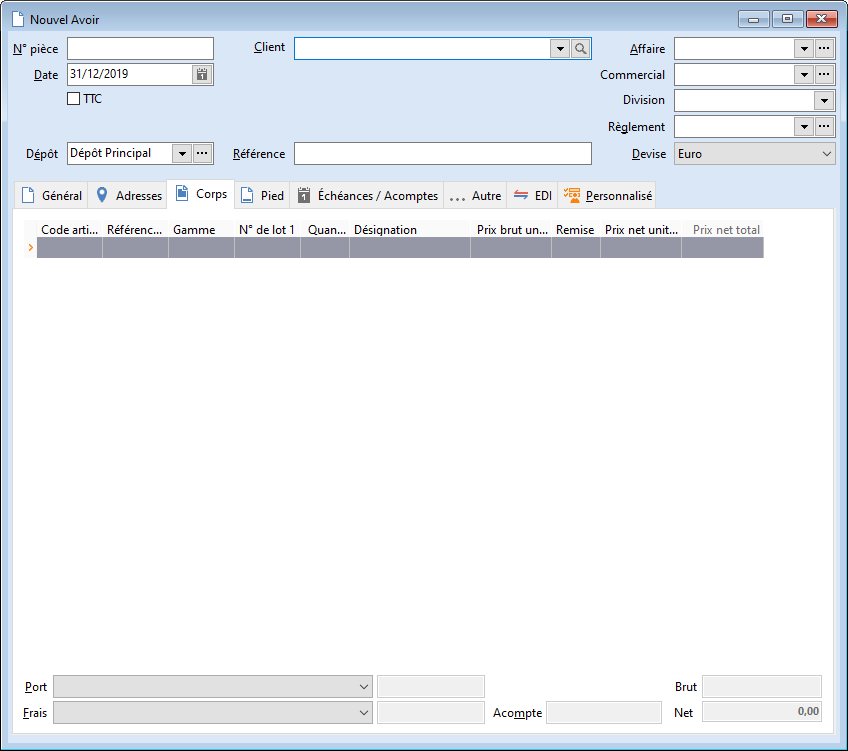

# Nouvel Avoir

L'avoir peut être réalisée manuellement, via transfert depuis une facture, 
 ou au travers d'un regroupement de bons de retour.

 

La avoir comptabilise les articles effectivement retournés par le client.

 

Les quantités en entrée sont mises à jour et l'avoir est comptabilisé.

 

L'avoir client met à jour le stock Actuel.

 

 

