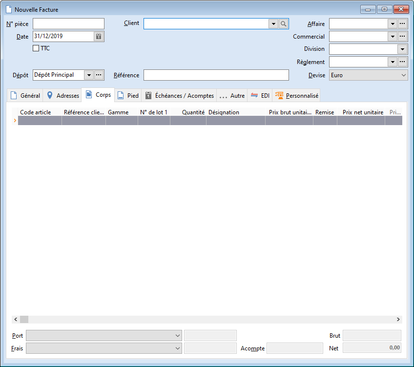

# Nouvelle Facture

La facture peut être réalisée manuellement, ou au travers d'un regroupement 
 de bons de livraison.

 

La facture comptabilise les articles effectivement vendus à un client.

 

Les quantités en sortie sont mises à jour et la vente est comptabilisée.

 

La facture client met à jour le stock Actuel.

 

