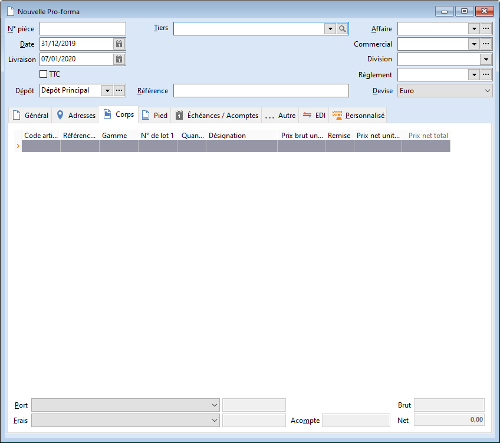

# Nouvelle Pro-forma

La facture pro-forma est un document commercial, qui ressemble à une 
 facture définitive sans en avoir la valeur légale. Elle ne peut donc pas 
 apparaître dans la comptabilité de l'entreprise.

 

Ce document permet de simplifier les échanges commerciaux entre fournisseur 
 et client essentiellement en B2B.

 

Ce document peut être transféré en devis, accusé de réception, bon de 
 livraison et facture.

 

La facture pro-forma n’a aucune incidence sur le stock.

 

