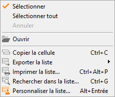

# Portefeuille des commandes

Une gestion plus complète des commandes fournisseurs et clients, qui 
 facilitera la réception des "Reliquats" et "En cours", 
 est disponible dans les menus VENTES | Portefeuille 
 de commandes.

 

 

et dans le menu ACHATS | Portefeuille de 
 commandes.

 

 

Critères :

* Période
* État
* Livraison
* Client ou Fournisseur
* Priorité du client ou du fournisseur
* Dépôt
* Article

 

 

 

La fenêtre affiche toutes les lignes d’articles (hors lignes textes 
 et totaux) des documents sélectionnés selon les critères disponibles.

 

Colonnes :

* Pièce
* Date
* Tiers
* Article
* Désignation
* Gamme
* Lot
* Stock Actuel du dépôt du document (de la fiche article)
* Quantité commandée
* Reste à livrer
* Montant calculé du reste à livrer

 

L’utilisateur pourra consulter et modifier le document de la ligne d’article 
 avant de transférer la commande fournisseur vers la pièce suivante.

 

La multi-sélection des lignes vous permettra au choix de sélectionner 
 les articles d’un seul tiers.

 

Le bouton "Transférer" génère  un nouveau document "Bon 
 de réception" ou "Facture" regroupant les lignes sélectionnées.

 

Un rapport d’anomalies bloquantes et non bloquantes est affiché.

 

Si les conditions de regroupement ne sont pas respectées, le logiciel 
 générera un nouveau document transféré par document sélectionné.

 

Boutons : "Sélectionner", 
 "Annuler", "Ouvrir" (la consultation et la modification 
 du document sélectionné sera possible, il faudra réactualiser l’affichage 
 par la touche F5 ou le bouton "Rechercher" pour prendre en compte 
 les modifications effectuées). Le bouton "Transférer" sera actif 
 après sélection des éléments à traiter.

 

Remarque : Si un même code article 
 s’affiche plusieurs fois sur la liste, le stock réel affiché sur toutes 
 les lignes sera celui disponible dans l’onglet stock de la fiche article.

### Menu contextuel

 

Dans le menu contextuel de cette grille, vous disposez des fonctions 
 suivantes :

* Sélectionner
* Sélectionner Tout
* Annuler la sélection
* Ouvrir
* Exporter la liste : Excel, HTML, texte
* Rechercher dans la liste
* Personnaliser la liste : Dépôt du document, Devise, Date prévu 
 le, Affaire. , Qte. Livrée, Total Commandes clients (Fiche article/onglet 
 stock), Total commandes fournisseurs (Fiche article/onglet Stock).

 

Les données suivantes correspondent au montant total affiché en pied 
 du document, elles seront disponibles dans toutes les lignes du document 
 : 

* Montant Frais
* Montant Port
* Montant Frais supplémentaires,
* Montant Escompte du pied,
* Montant Remise

 

Le tri est possible sur toutes les colonnes de la grille.

## Pied

La colonne quantité du reste à livrer et le montant total du reste à 
 livrer seront totalisées.

## Conditions de transfert

Le transfert est possible si les documents sont du même type (AR), même 
 tiers, même devise, même payeur, même affaire, même commercial, même nature 
 comptable, même type de facturation TTC coché ou non dans tous les documents.

 

Si la remise, frais, frais de port, frais sup. escompte ne sont pas 
 identiques dans les pieds de documents, ils ne seront pas récupérés dans 
 le document généré, l’utilisateur pourra ajouter ces éléments directement 
 sur le document modifié.

 

Les acomptes seront cumulés dans le document regroupé.

 

Si les tarifs ne sont pas identiques, les tarifs des lignes seront récupérés, 
 par contre celui de l’onglet entête du document sera ignoré.

 

Si les dépôts sont différents, le transfert est possible, le dépôt principal 
 sera pris en compte.

